# Architecture Overview

This page provides a high-level overview of the **overall** system architecture, including component diagrams and module relationships.

## Table of Contents

- [System Architecture](#system-architecture)
- [Component Diagram](#component-diagram)
- [Module Structure](#module-structure)
- [Deployment Architecture](#deployment-architecture)
- [Technology Stack](#technology-stack)

## System Architecture

The GitHub Repository Manager follows a **client-server architecture** with a Rust backend and WebAssembly frontend:

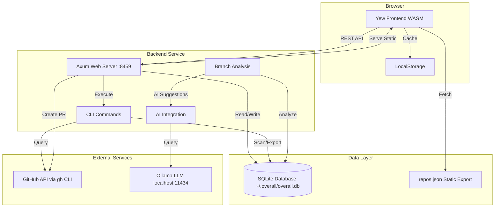

### Key Architectural Principles

1. **Separation of Concerns**: Clear boundaries between CLI, server, and UI layers
2. **Data-Driven**: SQLite as single source of truth for repository data
3. **Offline-First**: Static JSON export allows UI to work without backend
4. **External Integration**: All GitHub operations through `gh` CLI (no direct API calls)
5. **Local AI**: Optional Ollama integration for privacy-focused analysis

## Component Diagram

### High-Level Components

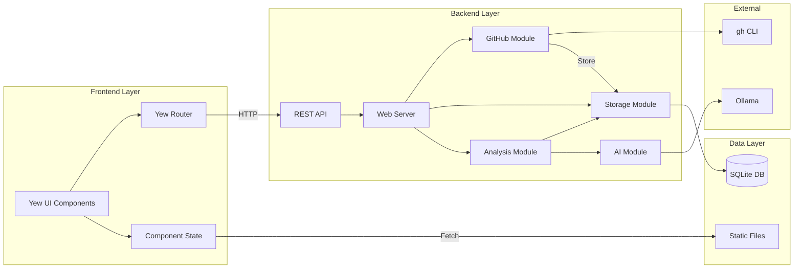

### Component Responsibilities

| Component | Responsibility | Technology |
|-----------|---------------|------------|
| **Yew UI** | Render tables, handle user interactions, manage UI state | Yew, WASM, web-sys |
| **Web Server** | Serve static files, handle REST API requests | Axum, tokio |
| **GitHub Module** | Execute `gh` CLI commands, parse JSON responses | std::process::Command, serde_json |
| **Storage Module** | Database CRUD operations, schema management | rusqlite, SQL |
| **Analysis Module** | Calculate branch status, priority scoring | Rust |
| **AI Module** | Query Ollama for project analysis | ask CLI, Ollama API |

## Module Structure

### Backend Modules (overall-cli)

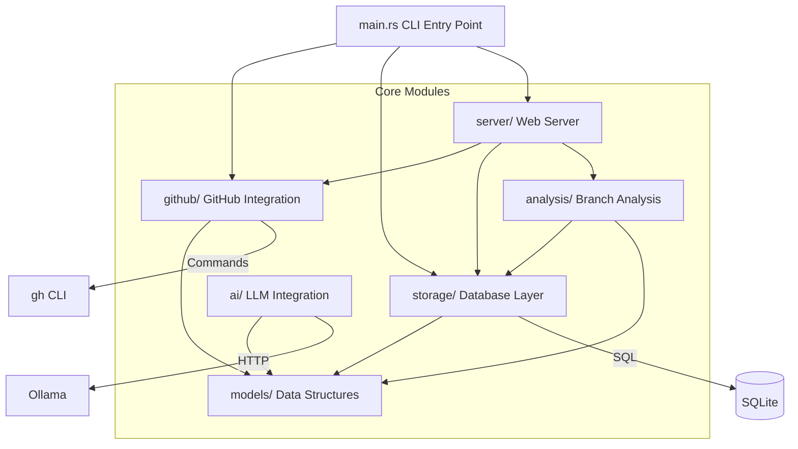

#### Module Details

**github/** - GitHub API Integration
- `commands.rs` - Execute gh CLI commands
- `mod.rs` - Public API and data transformations
- Parses JSON output into internal models
- Handles authentication through gh CLI

**storage/** - Data Persistence
- `mod.rs` - Database wrapper and operations
- `schema.sql` - SQL schema definition (embedded)
- CRUD operations for repos, branches, PRs, commits, groups
- Connection pooling and transaction management

**analysis/** - Repository Analysis
- Branch status calculation (ReadyForPR, NeedsSync, etc.)
- Priority scoring algorithm
- Merge readiness detection
- Conflict detection

**ai/** - AI Integration
- Ollama LLM queries via ask CLI
- Project analysis prompts
- Next-step suggestions
- Priority recommendations

**server/** - Web Server
- Axum routes and handlers
- REST API endpoints
- Static file serving
- Build info generation

**models/** - Shared Data Structures
- `Repository`, `Branch`, `Commit`, `PullRequest`
- `Group`, `LocalRepoStatus`
- `BranchStatus` enum
- Serialization/deserialization logic

### Frontend Module (wasm-ui)

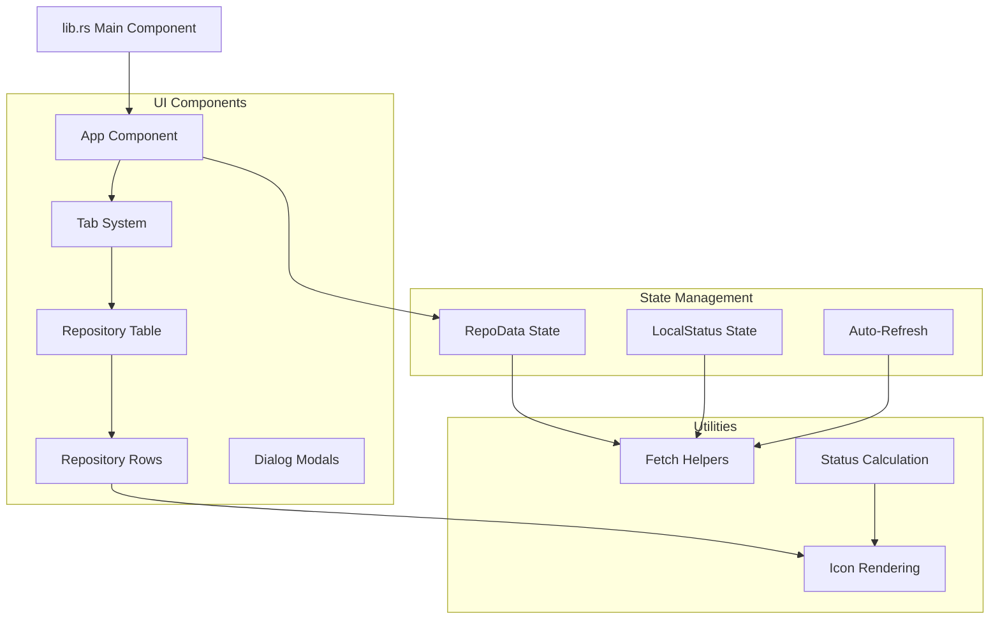

#### Component Hierarchy

```
App (root)
├── TabBar
│   ├── Tab (each group)
│   │   └── StatusIcon
│   └── RefreshButton
├── RepositoryTable
│   ├── TableHeader (sortable)
│   └── RepositoryRow (foreach repo)
│       ├── StatusIcon
│       ├── RepoName
│       ├── BranchesColumn
│       ├── LastActivityColumn
│       └── ActionsColumn
│           ├── CreatePRButton
│           └── RefreshButton
└── DialogManager
    ├── AddGroupDialog
    ├── AddLocalRootDialog
    └── CreatePRDialog
```

## Deployment Architecture

### Local Development Environment

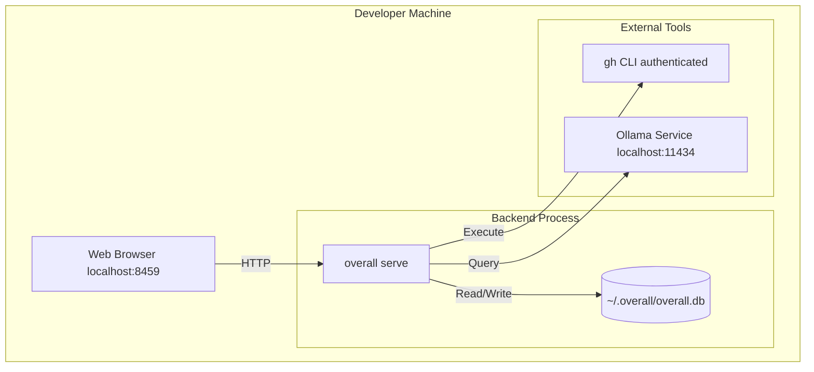

### Production Deployment (Local Desktop)

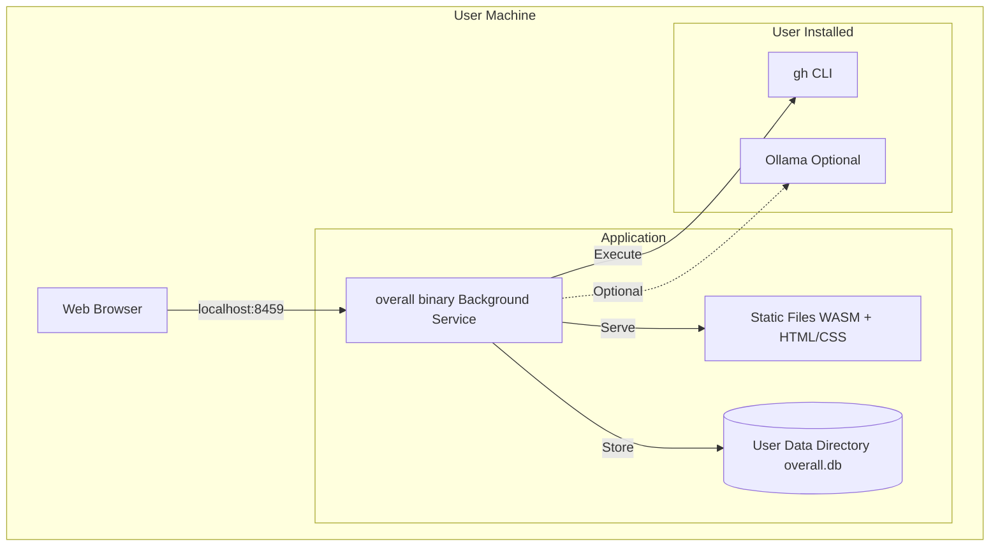

### Future: Cloud Deployment

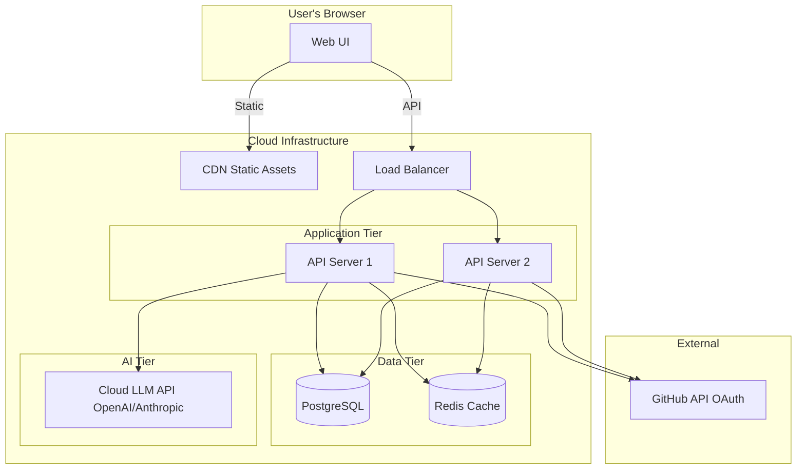

## Technology Stack

### Backend Stack

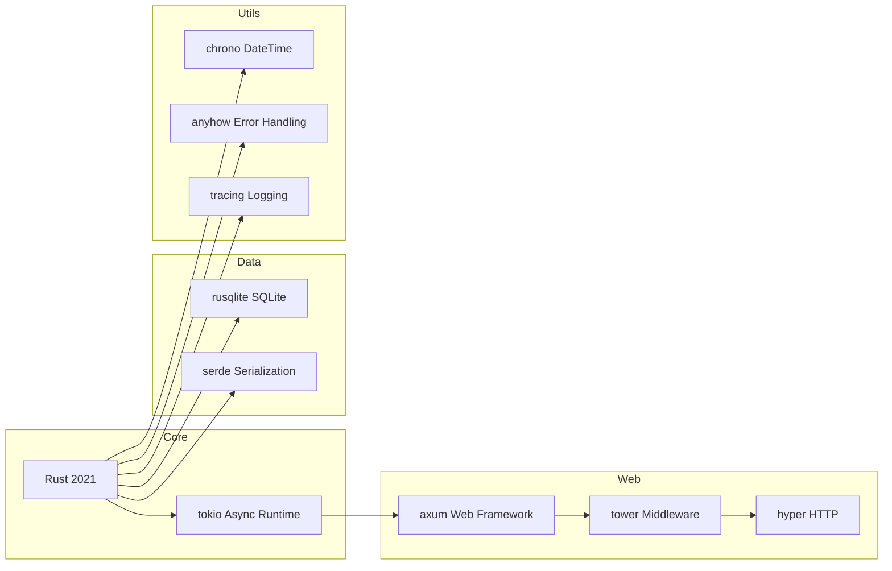

### Frontend Stack

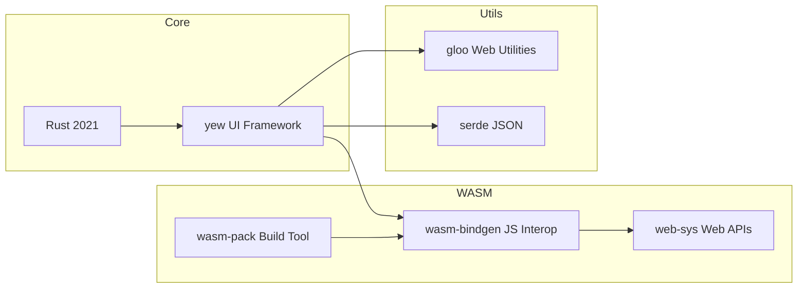

### Build Pipeline

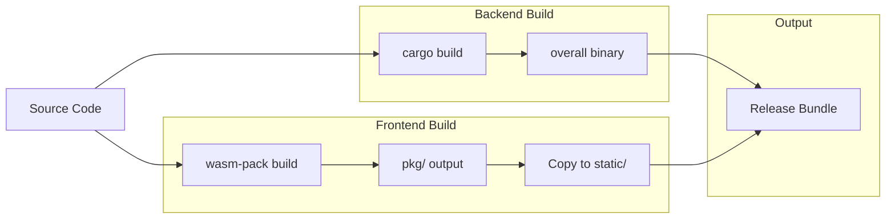

## Performance Characteristics

### Scalability Limits

| Resource | v1.0 Target | Notes |
|----------|------------|-------|
| GitHub Users | 5-10 | Can monitor multiple orgs |
| Total Repositories | 500+ | Top 50/user prioritized |
| Concurrent Users | 1 | Local desktop app |
| Database Size | <100MB | Metadata only |
| WASM Bundle | ~2MB | Optimized release build |

### Performance Optimizations

1. **GitHub API Rate Limiting**
   - 5000 requests/hour (authenticated)
   - Aggressive caching in SQLite
   - Batch requests where possible

2. **Database Indexing**
   - Indexes on `pushed_at`, `priority`, `repo_id`
   - Prepared statements for common queries
   - Foreign key cascades for cleanup

3. **Frontend Optimization**
   - Static JSON export (no backend required for viewing)
   - LocalStorage caching
   - Lazy loading for large repo lists
   - Optimized WASM bundle size

4. **AI Analysis**
   - Lazy evaluation (on-demand)
   - Result caching (24 hours)
   - Parallel processing (max 3 concurrent)

## Security Model

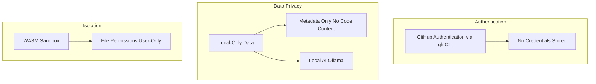

### Security Features

- **No Credential Storage**: Uses `gh` CLI which manages its own secure authentication
- **Local Data Only**: SQLite database stored in user home directory with restricted permissions
- **Privacy-First AI**: Ollama runs locally, no data sent to cloud services
- **WASM Sandbox**: Frontend runs in browser security sandbox
- **Metadata Only**: Only stores repository metadata, never actual code content

## Related Documentation

- [Data Flow](Data-Flow) - Detailed sequence diagrams for key workflows
- [Storage Layer](Storage-Layer) - Database schema and ER diagrams
- [Web Server & API](Web-Server-API) - REST API endpoint documentation
- [GitHub Integration](GitHub-Integration) - GitHub API integration details
- [UI Components](UI-Components) - Frontend component architecture

---

[← Back to Home](Home)
