# Data Flow & Sequence Diagrams

This page documents the key data flows and workflows in the **overall** system through detailed sequence diagrams.

## Table of Contents

- [Initial Repository Scan](#initial-repository-scan)
- [Export to JSON](#export-to-json)
- [Web UI Loading](#web-ui-loading)
- [Local Repository Scan](#local-repository-scan)
- [Create Pull Request](#create-pull-request)
- [Refresh Repository Data](#refresh-repository-data)
- [AI Analysis Workflow](#ai-analysis-workflow)
- [Group Management](#group-management)

## Initial Repository Scan

This is the primary workflow for importing repositories from GitHub into the local database.


### Key Steps

1. **Authentication Check**: Verify `gh` CLI is authenticated
2. **Repository List**: Fetch top 50 most recently pushed repos
3. **Sort by Activity**: Order by `pushedAt` timestamp
4. **Parallel Branch Fetch**: For each repo, get all branches
5. **PR Status Check**: Identify which branches have open PRs
6. **Calculate Ahead/Behind**: Compare each branch to default branch
7. **Persist to DB**: Store all metadata in SQLite

### Performance Considerations

- **Rate Limiting**: Respects GitHub's 5000 req/hour limit
- **Batch Processing**: Groups API calls where possible
- **Incremental Updates**: Future enhancement to only fetch changes

## Export to JSON

Exports the database to a static JSON file for the web UI.


### JSON Structure

```json
{
  "groups": [
    {
      "id": 1,
      "name": "Active Projects",
      "repos": [
        {
          "id": "repo123",
          "owner": "username",
          "name": "project",
          "unmerged_count": 2,
          "branches": [
            {
              "name": "feature-x",
              "ahead": 5,
              "behind": 0,
              "status": "ReadyForPR"
            }
          ],
          "pull_requests": [ ... ]
        }
      ]
    }
  ],
  "last_export": "2025-11-17T12:00:00Z"
}
```

## Web UI Loading

Shows how the Yew frontend loads and displays repository data.


### Loading Phases

1. **Static Load**: HTML, CSS, WASM bundle
2. **Initial Data**: Fetch `repos.json` from server
3. **Local Status**: Query backend for local git status
4. **Render**: Display repository table with status icons
5. **Auto-Refresh**: Poll for updates every 60 seconds

## Local Repository Scan

Scans local filesystem for git repositories and checks their status.


### Status Detection

The system detects:
- **Uncommitted files**: `git status --porcelain | wc -l`
- **Unpushed commits**: `git rev-list @{u}.. | wc -l`
- **Behind commits**: `git rev-list ..@{u} | wc -l`
- **Dirty working tree**: `git diff-index --quiet HEAD`

### Status Priority

```mermaid
graph TD
    Start[Check Repository] --> Unpushed{Unpushed or<br/>Behind?}
    Unpushed -->|Yes| NeedsSync[Priority 0:<br/>NEEDS SYNC 🔴]
    Unpushed -->|No| Uncommitted{Uncommitted<br/>Files?}
    Uncommitted -->|Yes| LocalChanges[Priority 1:<br/>LOCAL CHANGES ⚠️]
    Uncommitted -->|No| Unmerged{Unmerged<br/>Branches?}
    Unmerged -->|Yes| Stale[Priority 2:<br/>STALE ℹ️]
    Unmerged -->|No| Complete[Priority 3:<br/>COMPLETE ✅]
```



## Create Pull Request

Workflow for creating a pull request from the UI.


### Validation Rules

Before creating a PR:
1. **No existing PR**: Check `pull_requests` table
2. **Ahead of base**: Branch must have commits not in base
3. **Valid base branch**: Typically `main`, `master`, or `develop`
4. **No merge conflicts**: GitHub will validate on creation

## Refresh Repository Data

User-initiated refresh of a specific repository.


### Refresh Triggers

- **Manual**: User clicks refresh button
- **Automatic**: After creating PR or modifying groups
- **Periodic**: Optional background refresh (future)

## AI Analysis Workflow

How AI analysis is performed using local Ollama.


### Analysis Prompt Template

```
Repository: {owner}/{name}
Language: {primary_language}
Last activity: {pushed_at}

Unmerged branches:
- {branch_name}: {ahead_by} commits ahead, {behind_by} behind
  Last commit: {last_commit_date}

Analyze this repository and suggest:
1. Which branch should be prioritized
2. Whether branches are feature-complete
3. Recommended next steps
4. Priority score (1-10, where 10 is highest)
```

### AI Features

- **Local Processing**: Runs on user's machine via Ollama
- **Privacy-First**: No data sent to cloud
- **Caching**: Results cached for 24 hours
- **Parallel Processing**: Max 3 concurrent analyses
- **Optional**: System works without AI

## Group Management

Creating and managing repository groups.


### Group Operations

| Operation | Endpoint | Description |
|-----------|----------|-------------|
| Create Group | `POST /api/groups` | Add new group with name |
| Delete Group | `DELETE /api/groups/:id` | Remove group (repos become ungrouped) |
| Reorder Groups | `PUT /api/groups/reorder` | Update display_order |
| Add Repo to Group | `POST /api/groups/:id/repos/:repo_id` | Move repo to group |
| Remove from Group | `DELETE /api/groups/:id/repos/:repo_id` | Make repo ungrouped |

## Data Consistency

### Transaction Boundaries

All mutations use SQLite transactions:

```sql
BEGIN TRANSACTION;
  -- Multiple related operations
  DELETE FROM repo_groups WHERE repo_id = ?;
  INSERT INTO repo_groups VALUES (?, ?, ?);
  UPDATE groups SET updated_at = ? WHERE id = ?;
COMMIT;
```

### Export Consistency

The export process ensures consistency:
1. **Single Transaction**: Read all data in one transaction
2. **Atomic Write**: Write JSON atomically (temp file + rename)
3. **Build Info**: Include timestamp and git commit hash
4. **Validation**: Verify JSON structure before serving

### Cache Invalidation


## Error Handling Flows

### GitHub API Error


### Database Error


## Related Documentation

- [Architecture Overview](Architecture-Overview) - High-level system architecture
- [GitHub Integration](GitHub-Integration) - Details on GitHub API usage
- [Storage Layer](Storage-Layer) - Database schema and queries
- [Web Server & API](Web-Server-API) - REST API endpoint documentation

---

[← Back to Home](Home)
