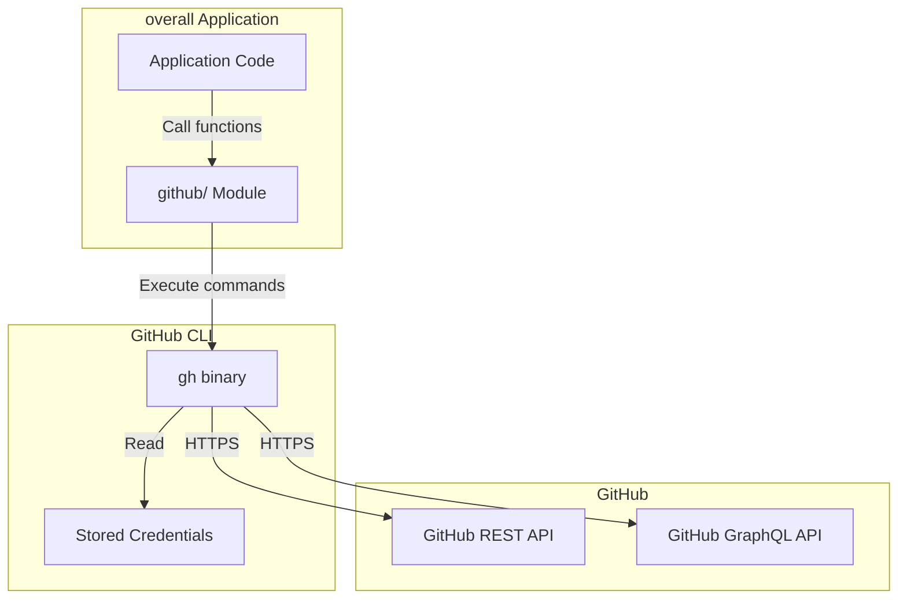
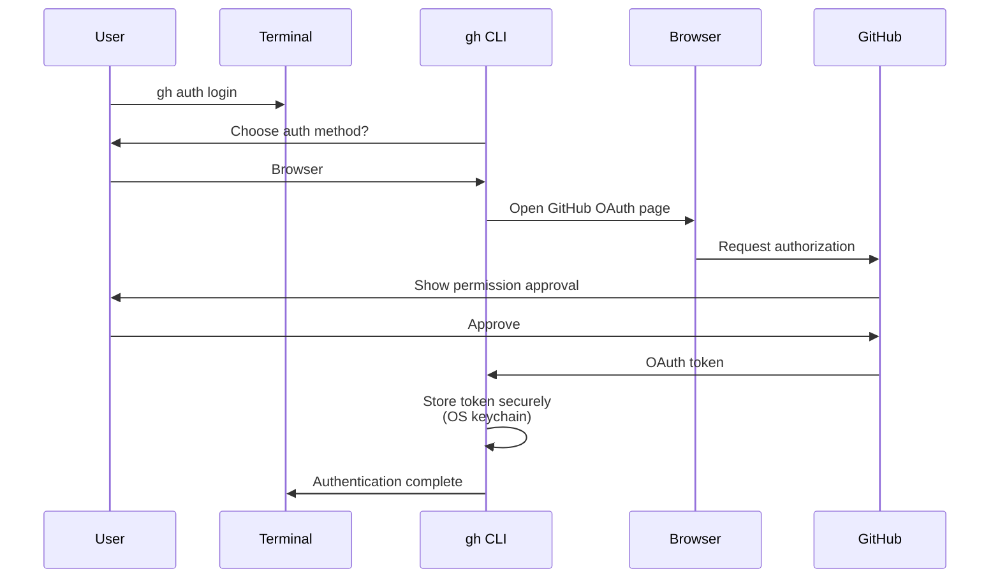
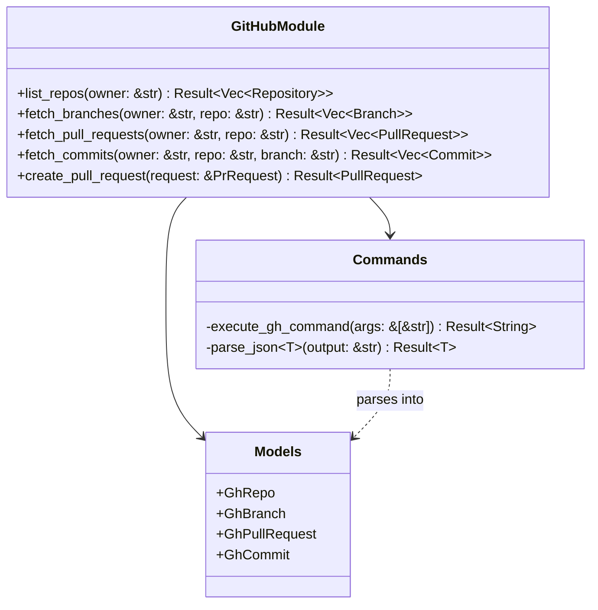
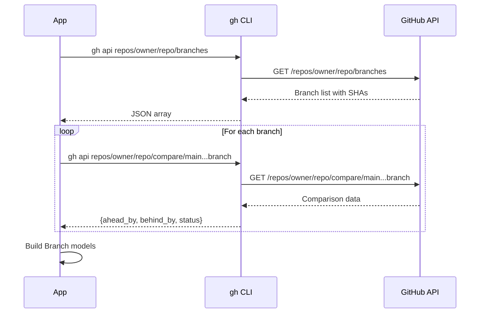
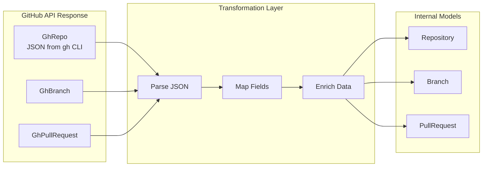
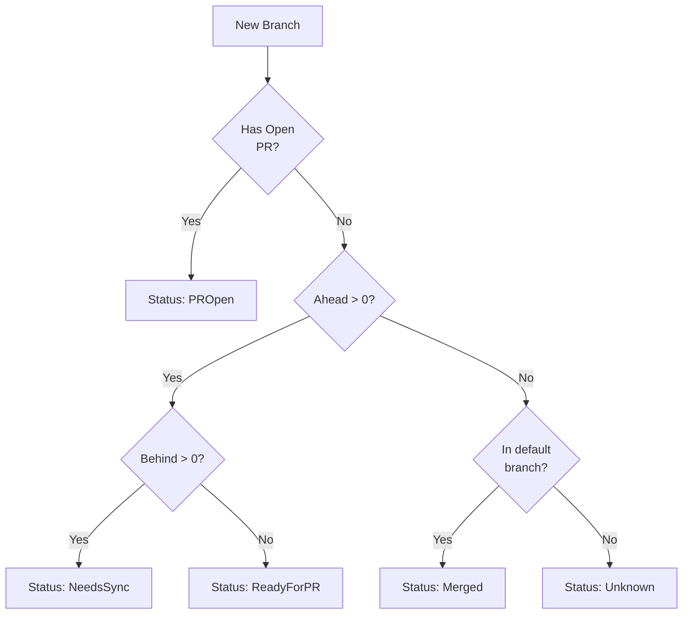
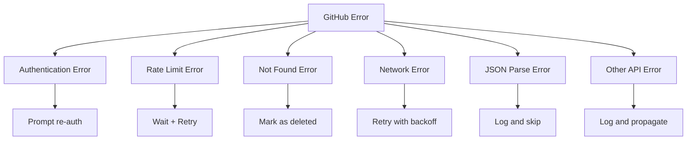
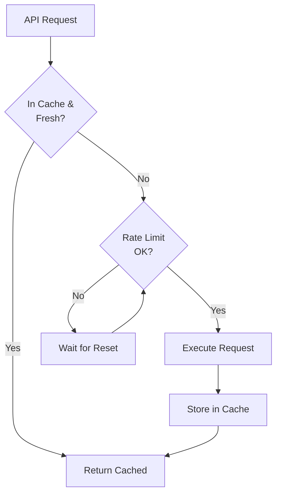

# GitHub Integration

This page documents how **overall** integrates with GitHub through the `gh` CLI tool.

## Table of Contents

- [Architecture](#architecture)
- [Authentication](#authentication)
- [GitHub Module Structure](#github-module-structure)
- [Key Operations](#key-operations)
- [Data Transformations](#data-transformations)
- [Error Handling](#error-handling)
- [Rate Limiting](#rate-limiting)

## Architecture

The GitHub integration is built entirely around the official GitHub CLI (`gh`) tool, rather than making direct REST API calls.



### Why `gh` CLI?

**Advantages:**
1. **Authentication Management**: `gh` handles OAuth flow and credential storage securely
2. **API Versioning**: `gh` maintains compatibility with GitHub API changes
3. **Rate Limiting**: `gh` respects rate limits and provides retry logic
4. **JSON Output**: `gh` provides structured JSON output for easy parsing
5. **Feature Parity**: Access to all GitHub features as they're added to `gh`

**Tradeoffs:**
- Requires `gh` to be installed and in PATH
- External process overhead (minimal impact)
- Less control over exact HTTP requests

## Authentication

Authentication is handled entirely by `gh` CLI.

### Setup Process



### Credential Storage

`gh` stores credentials in OS-specific secure storage:

| OS | Storage Location |
|----|------------------|
| macOS | Keychain |
| Linux | Secret Service API / gnome-keyring |
| Windows | Windows Credential Manager |

### Verification

The application checks authentication status before operations:

```bash
gh auth status
# Output:
# ✓ Logged in to github.com as username
# ✓ Token: *******************
```

## GitHub Module Structure

### File Organization

```
overall-cli/src/github/
├── mod.rs              # Public API and exports
├── commands.rs         # gh CLI execution functions
└── models.rs          # GitHub-specific data structures
```

### Module Diagram



## Key Operations

### 1. List Repositories

Fetches the top 50 most recently pushed repositories for a user/organization.

**Command:**
```bash
gh repo list <owner> \
  --limit 50 \
  --json name,owner,language,description,pushedAt,createdAt,updatedAt,isFork
```

**Implementation:**
```rust
pub fn list_repos(owner: &str) -> Result<Vec<Repository>> {
    let output = Command::new("gh")
        .args(&[
            "repo", "list", owner,
            "--limit", "50",
            "--json", "name,owner,language,description,pushedAt,createdAt,updatedAt,isFork",
        ])
        .output()?;

    let gh_repos: Vec<GhRepo> = serde_json::from_slice(&output.stdout)?;

    // Transform to internal Repository model
    let repos = gh_repos.into_iter()
        .map(|gh_repo| Repository {
            id: format!("{}/{}", gh_repo.owner.login, gh_repo.name),
            owner: gh_repo.owner.login,
            name: gh_repo.name,
            // ... other fields
        })
        .collect();

    Ok(repos)
}
```

**Response Structure:**
```json
[
  {
    "name": "overall",
    "owner": {
      "login": "softwarewrighter"
    },
    "language": "Rust",
    "description": "GitHub Repository Manager",
    "pushedAt": "2025-11-17T12:00:00Z",
    "createdAt": "2025-01-01T00:00:00Z",
    "updatedAt": "2025-11-17T11:55:00Z",
    "isFork": false
  }
]
```

### 2. Fetch Branches

Gets all branches for a repository with ahead/behind counts.

**Command:**
```bash
gh api repos/<owner>/<repo>/branches \
  --jq '.[] | {name, commit: .commit.sha}'
```

**Then for each branch:**
```bash
gh api repos/<owner>/<repo>/compare/<base>...<head> \
  --jq '{ahead: .ahead_by, behind: .behind_by}'
```

**Implementation Flow:**



**Comparison Response:**
```json
{
  "status": "ahead",
  "ahead_by": 5,
  "behind_by": 0,
  "total_commits": 5,
  "commits": [ ... ]
}
```

### 3. Fetch Pull Requests

Lists all pull requests for a repository.

**Command:**
```bash
gh pr list \
  --repo <owner>/<repo> \
  --json number,title,state,headRefName,baseRefName,createdAt,updatedAt \
  --limit 100
```

**Response:**
```json
[
  {
    "number": 42,
    "title": "Add new feature",
    "state": "OPEN",
    "headRefName": "feature-branch",
    "baseRefName": "main",
    "createdAt": "2025-11-15T10:00:00Z",
    "updatedAt": "2025-11-17T09:30:00Z"
  }
]
```

### 4. Fetch Commits

Gets commit history for a specific branch.

**Command:**
```bash
gh api repos/<owner>/<repo>/commits \
  --field sha=<branch> \
  --field per_page=50 \
  --jq '.[] | {sha, message: .commit.message, author: .commit.author, committer: .commit.committer}'
```

**Response:**
```json
[
  {
    "sha": "abc123def456",
    "message": "Add feature X",
    "author": {
      "name": "John Doe",
      "email": "john@example.com",
      "date": "2025-11-17T10:00:00Z"
    },
    "committer": {
      "name": "John Doe",
      "email": "john@example.com",
      "date": "2025-11-17T10:00:00Z"
    }
  }
]
```

### 5. Create Pull Request

Creates a new pull request from a branch.

**Command:**
```bash
gh pr create \
  --repo <owner>/<repo> \
  --head <branch> \
  --base <base-branch> \
  --title "PR Title" \
  --body "PR Description"
```

**Implementation:**
```rust
pub fn create_pull_request(request: &PrRequest) -> Result<PullRequest> {
    let body_file = tempfile::NamedTempFile::new()?;
    std::fs::write(&body_file, &request.body)?;

    let output = Command::new("gh")
        .args(&[
            "pr", "create",
            "--repo", &format!("{}/{}", request.owner, request.repo),
            "--head", &request.head,
            "--base", &request.base,
            "--title", &request.title,
            "--body-file", body_file.path().to_str().unwrap(),
        ])
        .output()?;

    // Parse URL from output
    let url = String::from_utf8(output.stdout)?.trim().to_string();

    // Extract PR number from URL
    let pr_number = extract_pr_number(&url)?;

    Ok(PullRequest {
        number: pr_number,
        state: "OPEN".to_string(),
        title: request.title.clone(),
        url,
        // ...
    })
}
```

## Data Transformations

### GitHub Models → Internal Models



### Field Mapping

#### Repository

| GitHub Field | Internal Field | Transformation |
|--------------|----------------|----------------|
| `name` | `name` | Direct |
| `owner.login` | `owner` | Extract from object |
| `pushedAt` | `pushed_at` | Parse ISO 8601 |
| `isFork` | `is_fork` | Boolean (0/1 in SQLite) |
| - | `id` | Computed: `{owner}/{name}` |
| - | `priority` | Calculated by analysis module |

#### Branch

| GitHub Field | Internal Field | Transformation |
|--------------|----------------|----------------|
| `name` | `name` | Direct |
| `commit.sha` | `sha` | Extract from commit object |
| Comparison API | `ahead_by` | From compare endpoint |
| Comparison API | `behind_by` | From compare endpoint |
| - | `status` | Calculated from ahead/behind/PRs |

### Branch Status Calculation



**Status Enum:**
```rust
pub enum BranchStatus {
    Unknown,       // No comparison data
    NeedsSync,     // Behind base branch
    ReadyForPR,    // Ahead, no PR
    PROpen,        // Has open PR
    Merged,        // Already merged
}
```

## Error Handling

### Error Types



### Error Handling Strategy

```rust
pub fn execute_gh_command(args: &[&str]) -> Result<String> {
    let output = Command::new("gh")
        .args(args)
        .output()
        .context("Failed to execute gh command")?;

    if !output.status.success() {
        let stderr = String::from_utf8_lossy(&output.stderr);

        // Parse specific error types
        if stderr.contains("authentication") {
            return Err(anyhow!("GitHub authentication required. Run: gh auth login"));
        }

        if stderr.contains("rate limit") {
            // Extract retry-after if available
            return Err(anyhow!("GitHub API rate limit exceeded"));
        }

        if stderr.contains("404") || stderr.contains("Not Found") {
            return Err(anyhow!("Repository or resource not found"));
        }

        return Err(anyhow!("gh command failed: {}", stderr));
    }

    Ok(String::from_utf8(output.stdout)?)
}
```

### Retry Logic

```rust
pub fn fetch_with_retry<T, F>(operation: F, max_retries: u32) -> Result<T>
where
    F: Fn() -> Result<T>,
{
    let mut attempts = 0;
    let mut delay = Duration::from_secs(2);

    loop {
        match operation() {
            Ok(result) => return Ok(result),
            Err(e) if attempts < max_retries => {
                if e.to_string().contains("rate limit") {
                    tracing::warn!("Rate limited, waiting {:?} before retry", delay);
                    std::thread::sleep(delay);
                    delay *= 2; // Exponential backoff
                    attempts += 1;
                } else {
                    return Err(e); // Don't retry non-rate-limit errors
                }
            }
            Err(e) => return Err(e),
        }
    }
}
```

## Rate Limiting

### GitHub API Limits

| Authentication | Rate Limit | Reset Period |
|----------------|------------|--------------|
| Authenticated (gh) | 5000 req/hr | 1 hour |
| Unauthenticated | 60 req/hr | 1 hour |

### Mitigation Strategies

1. **Aggressive Caching**: Store all data in SQLite, minimize API calls
2. **Batch Operations**: Combine related requests when possible
3. **Incremental Updates**: Only fetch changed data (future enhancement)
4. **Priority Queue**: Fetch most important repos first
5. **Rate Limit Monitoring**: Track remaining requests

### Rate Limit Tracking

```rust
pub struct RateLimitInfo {
    pub limit: u32,
    pub remaining: u32,
    pub reset_at: DateTime<Utc>,
}

pub fn check_rate_limit() -> Result<RateLimitInfo> {
    let output = Command::new("gh")
        .args(&["api", "rate_limit"])
        .output()?;

    let data: serde_json::Value = serde_json::from_slice(&output.stdout)?;

    Ok(RateLimitInfo {
        limit: data["resources"]["core"]["limit"].as_u64().unwrap() as u32,
        remaining: data["resources"]["core"]["remaining"].as_u64().unwrap() as u32,
        reset_at: DateTime::from_timestamp(
            data["resources"]["core"]["reset"].as_i64().unwrap(),
            0,
        ).unwrap(),
    })
}
```

### Optimization Techniques



## Testing Strategy

### Mock GitHub Client

For testing without actual GitHub API calls:

```rust
#[cfg(test)]
pub struct MockGitHubClient {
    pub repos: HashMap<String, Vec<Repository>>,
    pub branches: HashMap<String, Vec<Branch>>,
    pub prs: HashMap<String, Vec<PullRequest>>,
}

impl MockGitHubClient {
    pub fn new() -> Self {
        Self {
            repos: HashMap::new(),
            branches: HashMap::new(),
            prs: HashMap::new(),
        }
    }

    pub fn with_repo(mut self, owner: &str, repo: Repository) -> Self {
        self.repos
            .entry(owner.to_string())
            .or_insert_with(Vec::new)
            .push(repo);
        self
    }
}
```

### Integration Tests

For real GitHub API testing (requires authentication):

```rust
#[test]
#[ignore] // Run with: cargo test -- --ignored
fn test_real_github_api() {
    let repos = list_repos("softwarewrighter").unwrap();
    assert!(!repos.is_empty());

    let first_repo = &repos[0];
    let branches = fetch_branches(&first_repo.owner, &first_repo.name).unwrap();
    assert!(!branches.is_empty());
}
```

## Best Practices

1. **Always Check Authentication First**: Fail early if `gh` not authenticated
2. **Use Structured Output**: Always use `--json` flag for parseable output
3. **Handle Pagination**: Use `--limit` appropriately, default to 50-100
4. **Log Commands**: Use `tracing` to log all `gh` commands for debugging
5. **Timeout Long Operations**: Set reasonable timeouts for API calls
6. **Validate Input**: Check owner/repo names before passing to `gh`
7. **Parse Errors Carefully**: Extract meaningful error messages from stderr
8. **Cache Aggressively**: Store results in SQLite to minimize API calls

## Related Documentation

- [Data Flow](Data-Flow) - Sequence diagrams showing GitHub API workflows
- [Architecture Overview](Architecture-Overview) - High-level system design
- [Storage Layer](Storage-Layer) - How GitHub data is persisted

---

[← Back to Home](Home)
