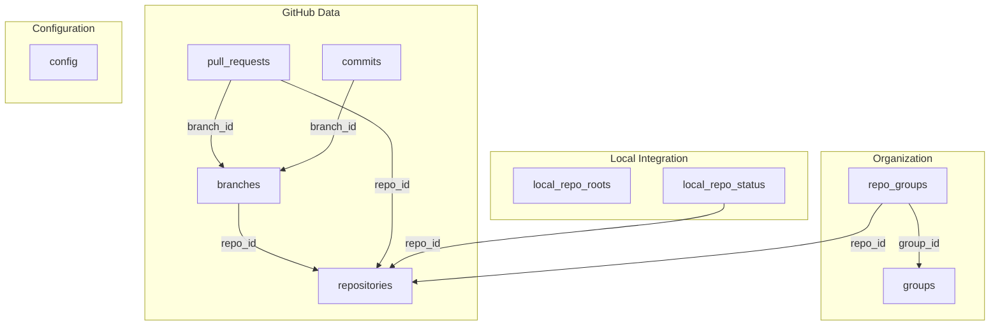
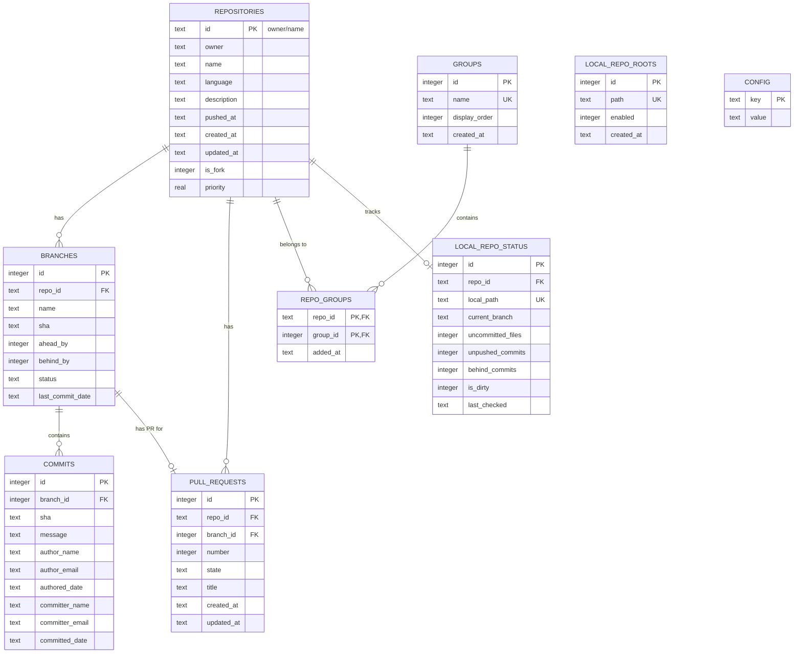
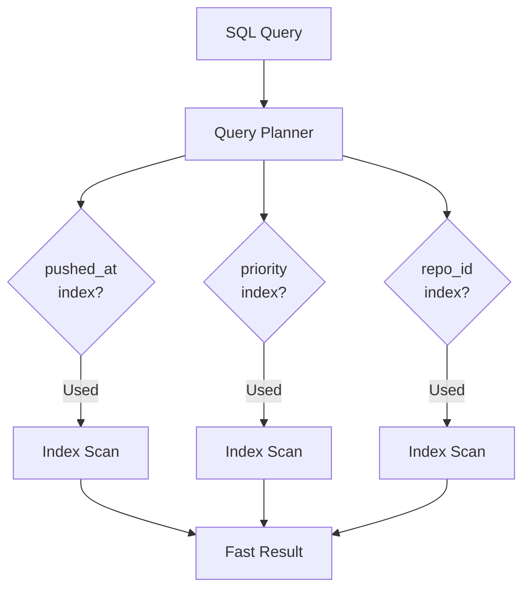
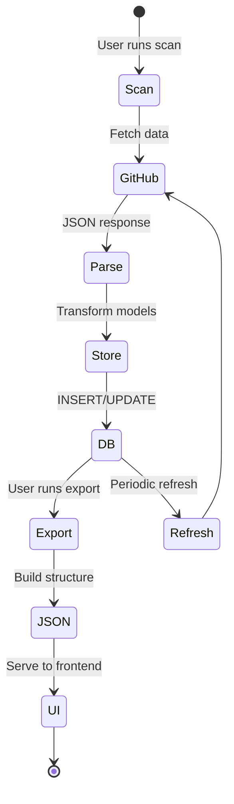
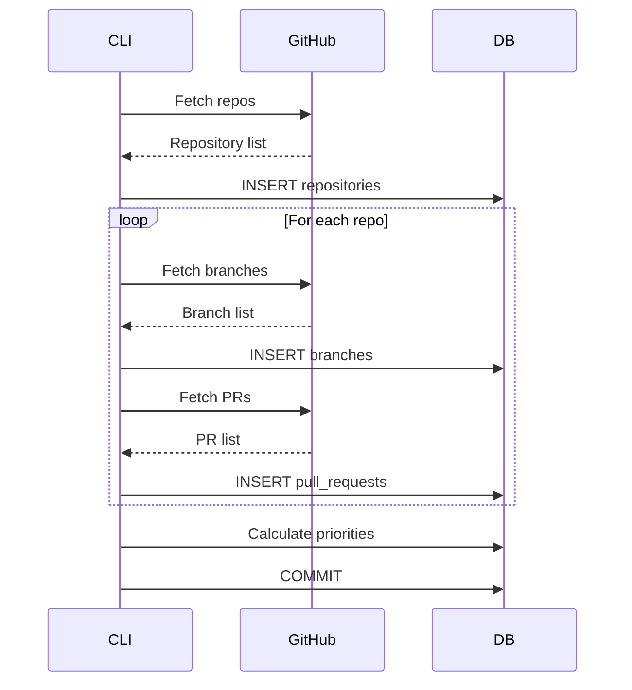

# Storage Layer

This page documents the SQLite database schema and data persistence layer for **overall**.

## Table of Contents

- [Overview](#overview)
- [Database Schema](#database-schema)
- [Entity Relationship Diagram](#entity-relationship-diagram)
- [Table Details](#table-details)
- [Indexes and Performance](#indexes-and-performance)
- [Database Operations](#database-operations)
- [Data Lifecycle](#data-lifecycle)

## Overview

**overall** uses SQLite as its primary data store, located at `~/.overall/overall.db`.

### Why SQLite?

- **Serverless**: No separate database process required
- **Zero Configuration**: Works out of the box
- **Reliable**: ACID-compliant transactions
- **Fast**: Excellent performance for local data
- **Portable**: Single file, easy to backup
- **Cross-Platform**: Works on all supported platforms

### Database Location

```
~/.overall/
├── overall.db          # Main database file
├── overall.db-shm      # Shared memory file (temporary)
└── overall.db-wal      # Write-ahead log (temporary)
```

## Database Schema

### Schema Version Management

The schema is embedded in the binary and applied on first run:

```rust
// overall-cli/src/storage/schema.sql
const SCHEMA: &str = include_str!("schema.sql");

pub fn initialize_database(conn: &Connection) -> Result<()> {
    conn.execute_batch(SCHEMA)?;
    Ok(())
}
```

### Core Tables



## Entity Relationship Diagram



## Table Details

### repositories

Stores GitHub repository metadata.

```sql
CREATE TABLE IF NOT EXISTS repositories (
    id TEXT PRIMARY KEY,                    -- Format: "owner/repo"
    owner TEXT NOT NULL,
    name TEXT NOT NULL,
    language TEXT,                          -- Primary language
    description TEXT,
    pushed_at TEXT NOT NULL,                -- ISO 8601 timestamp
    created_at TEXT NOT NULL,
    updated_at TEXT NOT NULL,
    is_fork INTEGER NOT NULL,               -- 0 or 1 (boolean)
    priority REAL NOT NULL DEFAULT 0.0      -- Calculated priority score
);

CREATE INDEX idx_repositories_pushed_at ON repositories(pushed_at DESC);
CREATE INDEX idx_repositories_priority ON repositories(priority DESC);
```

**Key Fields:**
- `id`: Composite primary key in format `owner/repo`
- `pushed_at`: Used for sorting by most recent activity
- `priority`: Calculated score (0.0 - 1.0) for ranking importance
- `is_fork`: SQLite boolean (0=false, 1=true)

**Common Queries:**
```sql
-- Get top 50 most recently pushed repos
SELECT * FROM repositories
ORDER BY pushed_at DESC
LIMIT 50;

-- Get highest priority repos
SELECT * FROM repositories
ORDER BY priority DESC
LIMIT 10;

-- Find repos by owner
SELECT * FROM repositories
WHERE owner = 'softwarewrighter'
ORDER BY pushed_at DESC;
```

### branches

Stores branch information with ahead/behind counts.

```sql
CREATE TABLE IF NOT EXISTS branches (
    id INTEGER PRIMARY KEY AUTOINCREMENT,
    repo_id TEXT NOT NULL,
    name TEXT NOT NULL,
    sha TEXT NOT NULL,                      -- Current commit SHA
    ahead_by INTEGER NOT NULL,              -- Commits ahead of base
    behind_by INTEGER NOT NULL,             -- Commits behind base
    status TEXT NOT NULL,                   -- BranchStatus enum
    last_commit_date TEXT NOT NULL,
    FOREIGN KEY (repo_id) REFERENCES repositories(id) ON DELETE CASCADE
);

CREATE INDEX idx_branches_repo_id ON branches(repo_id);
```

**Status Values:**
- `Unknown`: No comparison data available
- `NeedsSync`: Behind base branch (needs pull)
- `ReadyForPR`: Ahead with no open PR
- `PROpen`: Has an open pull request
- `Merged`: Already merged to base

**Common Queries:**
```sql
-- Get all branches for a repo
SELECT * FROM branches
WHERE repo_id = 'owner/repo'
ORDER BY last_commit_date DESC;

-- Find branches ready for PR
SELECT b.*, r.owner, r.name
FROM branches b
JOIN repositories r ON b.repo_id = r.id
WHERE b.status = 'ReadyForPR'
  AND b.name NOT IN ('main', 'master', 'develop');

-- Count unmerged branches per repo
SELECT repo_id, COUNT(*) as unmerged_count
FROM branches
WHERE status IN ('ReadyForPR', 'NeedsSync')
GROUP BY repo_id;
```

### pull_requests

Tracks pull requests from GitHub.

```sql
CREATE TABLE IF NOT EXISTS pull_requests (
    id INTEGER PRIMARY KEY,                 -- GitHub PR ID
    repo_id TEXT NOT NULL,
    branch_id INTEGER,                      -- May be NULL if branch deleted
    number INTEGER NOT NULL,                -- PR number (#42)
    state TEXT NOT NULL,                    -- OPEN, CLOSED, MERGED
    title TEXT NOT NULL,
    created_at TEXT NOT NULL,
    updated_at TEXT NOT NULL,
    FOREIGN KEY (repo_id) REFERENCES repositories(id) ON DELETE CASCADE,
    FOREIGN KEY (branch_id) REFERENCES branches(id) ON DELETE SET NULL
);

CREATE INDEX idx_prs_repo_id ON pull_requests(repo_id);
```

**State Values:**
- `OPEN`: PR is open and awaiting review/merge
- `CLOSED`: PR was closed without merging
- `MERGED`: PR was successfully merged

**Common Queries:**
```sql
-- Get open PRs for a repo
SELECT * FROM pull_requests
WHERE repo_id = 'owner/repo'
  AND state = 'OPEN'
ORDER BY updated_at DESC;

-- Find PRs for a specific branch
SELECT pr.*, b.name as branch_name
FROM pull_requests pr
JOIN branches b ON pr.branch_id = b.id
WHERE b.name = 'feature-branch';
```

### commits

Stores commit history for branches.

```sql
CREATE TABLE IF NOT EXISTS commits (
    id INTEGER PRIMARY KEY AUTOINCREMENT,
    branch_id INTEGER NOT NULL,
    sha TEXT NOT NULL,
    message TEXT NOT NULL,
    author_name TEXT NOT NULL,
    author_email TEXT NOT NULL,
    authored_date TEXT NOT NULL,
    committer_name TEXT NOT NULL,
    committer_email TEXT NOT NULL,
    committed_date TEXT NOT NULL,
    FOREIGN KEY (branch_id) REFERENCES branches(id) ON DELETE CASCADE,
    UNIQUE(branch_id, sha)                  -- Prevent duplicate commits
);

CREATE INDEX idx_commits_branch_id ON commits(branch_id);
CREATE INDEX idx_commits_committed_date ON commits(committed_date DESC);
```

**Common Queries:**
```sql
-- Get recent commits for a branch
SELECT * FROM commits
WHERE branch_id = 123
ORDER BY committed_date DESC
LIMIT 50;

-- Find commits by author
SELECT c.*, b.name as branch_name, r.name as repo_name
FROM commits c
JOIN branches b ON c.branch_id = b.id
JOIN repositories r ON b.repo_id = r.id
WHERE c.author_email = 'user@example.com'
ORDER BY c.committed_date DESC;
```

### groups

Repository grouping for organization.

```sql
CREATE TABLE IF NOT EXISTS groups (
    id INTEGER PRIMARY KEY AUTOINCREMENT,
    name TEXT NOT NULL UNIQUE,
    display_order INTEGER NOT NULL DEFAULT 0,
    created_at TEXT NOT NULL
);

CREATE INDEX idx_groups_display_order ON groups(display_order);
```

**Purpose:**
- Organize repos into logical groups (e.g., "Active", "Archived", "High Priority")
- Display as tabs in the UI
- Control order of tabs via `display_order`

**Common Queries:**
```sql
-- Get all groups in display order
SELECT * FROM groups
ORDER BY display_order ASC;

-- Create new group
INSERT INTO groups (name, display_order, created_at)
VALUES ('High Priority', 0, datetime('now'));
```

### repo_groups

Junction table for many-to-many relationship between repos and groups.

```sql
CREATE TABLE IF NOT EXISTS repo_groups (
    repo_id TEXT NOT NULL,
    group_id INTEGER NOT NULL,
    added_at TEXT NOT NULL,
    PRIMARY KEY (repo_id, group_id),
    FOREIGN KEY (repo_id) REFERENCES repositories(id) ON DELETE CASCADE,
    FOREIGN KEY (group_id) REFERENCES groups(id) ON DELETE CASCADE
);

CREATE INDEX idx_repo_groups_repo_id ON repo_groups(repo_id);
CREATE INDEX idx_repo_groups_group_id ON repo_groups(group_id);
```

**Constraints:**
- One repo can only be in one group at a time (enforced by PRIMARY KEY on repo_id)
- Deleting a group removes all associations
- Deleting a repo removes all group memberships

**Common Queries:**
```sql
-- Get all repos in a group
SELECT r.*
FROM repositories r
JOIN repo_groups rg ON r.id = rg.repo_id
WHERE rg.group_id = 1
ORDER BY r.pushed_at DESC;

-- Move repo to different group
BEGIN TRANSACTION;
DELETE FROM repo_groups WHERE repo_id = 'owner/repo';
INSERT INTO repo_groups (repo_id, group_id, added_at)
VALUES ('owner/repo', 2, datetime('now'));
COMMIT;

-- Find ungrouped repos
SELECT r.*
FROM repositories r
LEFT JOIN repo_groups rg ON r.id = rg.repo_id
WHERE rg.repo_id IS NULL;
```

### local_repo_roots

Stores filesystem paths to scan for local git repositories.

```sql
CREATE TABLE IF NOT EXISTS local_repo_roots (
    id INTEGER PRIMARY KEY AUTOINCREMENT,
    path TEXT NOT NULL UNIQUE,
    enabled INTEGER NOT NULL DEFAULT 1,
    created_at TEXT NOT NULL
);

CREATE INDEX idx_local_repo_roots_enabled ON local_repo_roots(enabled);
```

**Usage:**
- User adds paths like `/home/user/projects`
- Scanner walks these directories looking for `.git` folders
- `enabled` flag allows temporarily disabling a root without deleting

### local_repo_status

Tracks local git working directory status for repositories.

```sql
CREATE TABLE IF NOT EXISTS local_repo_status (
    id INTEGER PRIMARY KEY AUTOINCREMENT,
    repo_id TEXT NOT NULL,
    local_path TEXT NOT NULL UNIQUE,
    current_branch TEXT,
    uncommitted_files INTEGER NOT NULL DEFAULT 0,
    unpushed_commits INTEGER NOT NULL DEFAULT 0,
    behind_commits INTEGER NOT NULL DEFAULT 0,
    is_dirty INTEGER NOT NULL DEFAULT 0,
    last_checked TEXT NOT NULL,
    FOREIGN KEY (repo_id) REFERENCES repositories(id) ON DELETE CASCADE
);

CREATE INDEX idx_local_repo_status_repo_id ON local_repo_status(repo_id);
CREATE INDEX idx_local_repo_status_last_checked ON local_repo_status(last_checked DESC);
```

**Fields Explained:**
- `uncommitted_files`: Count from `git status --porcelain`
- `unpushed_commits`: Count from `git rev-list @{u}..`
- `behind_commits`: Count from `git rev-list ..@{u}`
- `is_dirty`: Boolean, true if working tree has changes
- `last_checked`: Timestamp of last scan

**Common Queries:**
```sql
-- Find repos with uncommitted changes
SELECT r.owner, r.name, lrs.uncommitted_files, lrs.local_path
FROM local_repo_status lrs
JOIN repositories r ON lrs.repo_id = r.id
WHERE lrs.uncommitted_files > 0
ORDER BY lrs.uncommitted_files DESC;

-- Find repos that need pushing
SELECT r.owner, r.name, lrs.unpushed_commits
FROM local_repo_status lrs
JOIN repositories r ON lrs.repo_id = r.id
WHERE lrs.unpushed_commits > 0
ORDER BY lrs.unpushed_commits DESC;

-- Repositories needing sync (push or pull)
SELECT r.owner, r.name, lrs.unpushed_commits, lrs.behind_commits
FROM local_repo_status lrs
JOIN repositories r ON lrs.repo_id = r.id
WHERE lrs.unpushed_commits > 0 OR lrs.behind_commits > 0;
```

### config

Key-value store for application configuration.

```sql
CREATE TABLE IF NOT EXISTS config (
    key TEXT PRIMARY KEY,
    value TEXT NOT NULL
);
```

**Example Config:**
```sql
INSERT INTO config VALUES ('last_scan_time', '2025-11-17T12:00:00Z');
INSERT INTO config VALUES ('default_owner', 'softwarewrighter');
INSERT INTO config VALUES ('auto_refresh_interval', '60');
```

## Indexes and Performance

### Index Strategy



### Index List

| Table | Index | Purpose |
|-------|-------|---------|
| repositories | `idx_repositories_pushed_at` | Sort by recent activity |
| repositories | `idx_repositories_priority` | Sort by priority score |
| branches | `idx_branches_repo_id` | JOIN performance |
| pull_requests | `idx_prs_repo_id` | JOIN performance |
| commits | `idx_commits_branch_id` | JOIN performance |
| commits | `idx_commits_committed_date` | Sort by commit time |
| groups | `idx_groups_display_order` | Tab ordering |
| repo_groups | `idx_repo_groups_repo_id` | Lookup repos in group |
| repo_groups | `idx_repo_groups_group_id` | Lookup groups for repo |
| local_repo_roots | `idx_local_repo_roots_enabled` | Filter active roots |
| local_repo_status | `idx_local_repo_status_repo_id` | JOIN performance |
| local_repo_status | `idx_local_repo_status_last_checked` | Find stale status |

### Query Performance

Example EXPLAIN output for common query:

```sql
EXPLAIN QUERY PLAN
SELECT r.*, COUNT(b.id) as branch_count
FROM repositories r
LEFT JOIN branches b ON r.id = b.repo_id
WHERE r.owner = 'softwarewrighter'
GROUP BY r.id
ORDER BY r.pushed_at DESC
LIMIT 50;
```

```
QUERY PLAN
|--SCAN r USING INDEX idx_repositories_pushed_at
|--SEARCH b USING INDEX idx_branches_repo_id (repo_id=?)
`--USE TEMP B-TREE FOR GROUP BY
```

## Database Operations

### CRUD Operations

```rust
// Create
pub fn insert_repository(conn: &Connection, repo: &Repository) -> Result<()> {
    conn.execute(
        "INSERT INTO repositories (id, owner, name, language, description,
         pushed_at, created_at, updated_at, is_fork, priority)
         VALUES (?1, ?2, ?3, ?4, ?5, ?6, ?7, ?8, ?9, ?10)",
        params![
            repo.id, repo.owner, repo.name, repo.language, repo.description,
            repo.pushed_at, repo.created_at, repo.updated_at,
            repo.is_fork as i32, repo.priority
        ],
    )?;
    Ok(())
}

// Read
pub fn get_repository(conn: &Connection, id: &str) -> Result<Option<Repository>> {
    let mut stmt = conn.prepare(
        "SELECT id, owner, name, language, description, pushed_at,
         created_at, updated_at, is_fork, priority
         FROM repositories WHERE id = ?1"
    )?;

    let repo = stmt.query_row(params![id], |row| {
        Ok(Repository {
            id: row.get(0)?,
            owner: row.get(1)?,
            name: row.get(2)?,
            // ... other fields
        })
    }).optional()?;

    Ok(repo)
}

// Update
pub fn update_repository_priority(conn: &Connection, id: &str, priority: f64) -> Result<()> {
    conn.execute(
        "UPDATE repositories SET priority = ?1 WHERE id = ?2",
        params![priority, id],
    )?;
    Ok(())
}

// Delete
pub fn delete_repository(conn: &Connection, id: &str) -> Result<()> {
    conn.execute("DELETE FROM repositories WHERE id = ?1", params![id])?;
    // Cascades to branches, PRs, commits via FK constraints
    Ok(())
}
```

### Transactions

```rust
pub fn move_repo_to_group(
    conn: &Connection,
    repo_id: &str,
    group_id: i64,
) -> Result<()> {
    let tx = conn.transaction()?;

    // Remove from current group
    tx.execute(
        "DELETE FROM repo_groups WHERE repo_id = ?1",
        params![repo_id],
    )?;

    // Add to new group
    tx.execute(
        "INSERT INTO repo_groups (repo_id, group_id, added_at)
         VALUES (?1, ?2, datetime('now'))",
        params![repo_id, group_id],
    )?;

    tx.commit()?;
    Ok(())
}
```

### Batch Operations

```rust
pub fn insert_branches_batch(
    conn: &Connection,
    repo_id: &str,
    branches: &[Branch],
) -> Result<()> {
    let tx = conn.transaction()?;

    // Delete existing branches
    tx.execute("DELETE FROM branches WHERE repo_id = ?1", params![repo_id])?;

    // Prepare insert statement
    let mut stmt = tx.prepare(
        "INSERT INTO branches (repo_id, name, sha, ahead_by, behind_by,
         status, last_commit_date) VALUES (?1, ?2, ?3, ?4, ?5, ?6, ?7)"
    )?;

    // Batch insert
    for branch in branches {
        stmt.execute(params![
            repo_id, branch.name, branch.sha, branch.ahead_by,
            branch.behind_by, branch.status, branch.last_commit_date
        ])?;
    }

    tx.commit()?;
    Ok(())
}
```

## Data Lifecycle

### Data Flow Diagram



### Lifecycle Operations

#### 1. Initial Scan


#### 2. Export to JSON
```sql
-- Single query to build export data
SELECT
    g.id as group_id,
    g.name as group_name,
    r.id, r.owner, r.name, r.language, r.description,
    r.pushed_at, r.priority,
    b.id as branch_id, b.name as branch_name,
    b.ahead_by, b.behind_by, b.status,
    pr.number, pr.state, pr.title
FROM groups g
LEFT JOIN repo_groups rg ON g.id = rg.group_id
LEFT JOIN repositories r ON rg.repo_id = r.id
LEFT JOIN branches b ON r.id = b.repo_id
LEFT JOIN pull_requests pr ON b.id = pr.branch_id
ORDER BY g.display_order, r.pushed_at DESC;
```

#### 3. Cleanup Old Data
```sql
-- Delete merged branches older than 30 days
DELETE FROM branches
WHERE status = 'Merged'
  AND last_commit_date < date('now', '-30 days');

-- Archive inactive repos (no push in 1 year)
DELETE FROM repositories
WHERE pushed_at < date('now', '-1 year')
  AND id NOT IN (SELECT repo_id FROM repo_groups);
```

## Related Documentation

- [Architecture Overview](Architecture-Overview) - System design
- [Data Flow](Data-Flow) - Sequence diagrams for data operations
- [GitHub Integration](GitHub-Integration) - How data is fetched from GitHub

---

[← Back to Home](Home)
