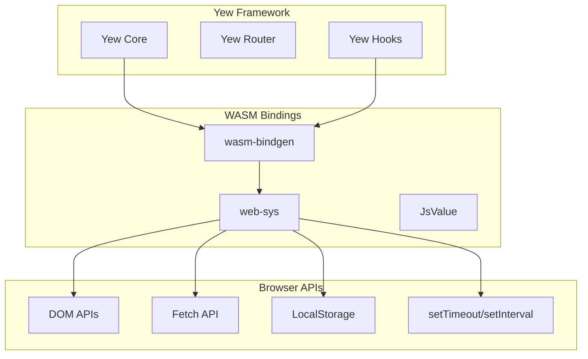
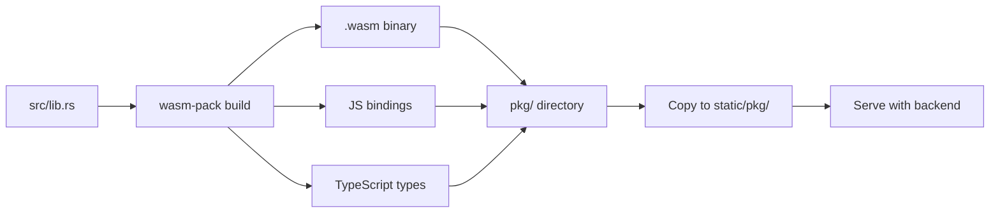
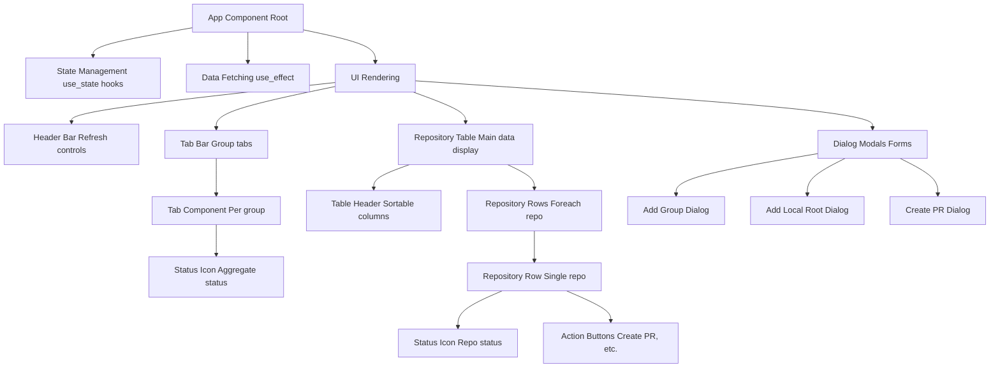
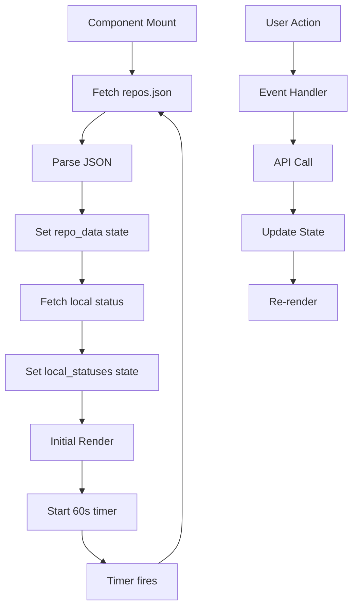
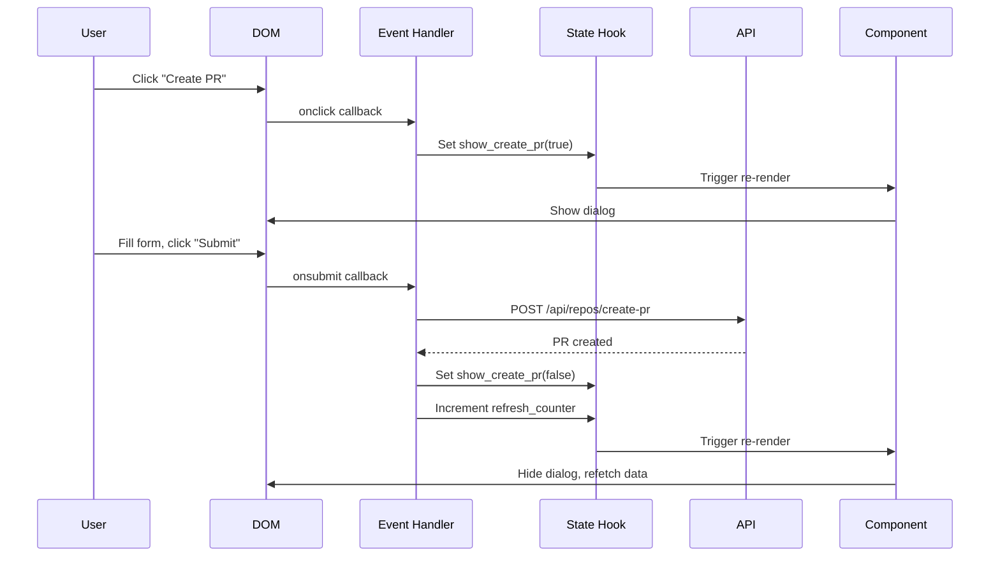

# UI Components

This page documents the Yew/WASM frontend architecture and component structure for **overall**.

## Table of Contents

- [Frontend Architecture](#frontend-architecture)
- [Component Hierarchy](#component-hierarchy)
- [State Management](#state-management)
- [Status Icon System](#status-icon-system)
- [User Interactions](#user-interactions)
- [Data Fetching](#data-fetching)
- [Styling](#styling)

## Frontend Architecture

### Technology Stack



### Build Process



**Build Commands:**
```bash
# Development build
cd wasm-ui && wasm-pack build --target web --dev

# Production build (optimized)
cd wasm-ui && wasm-pack build --target web --release

# Automated via script
./scripts/build-all.sh
```

## Component Hierarchy

### Overall Structure



### Component Tree

```
App
├── <div class="header">
│   ├── <h1>GitHub Repository Manager</h1>
│   ├── <button onclick="refresh_all">Refresh All</button>
│   └── <button onclick="add_group">Add Group</button>
│
├── <div class="tabs">
│   ├── <div class="tab" foreach group>
│   │   ├── 
│   │   ├── <span>{group.name}</span>
│   │   └── <span class="count">({repo_count})</span>
│   └── <div class="tab-add">+</div>
│
├── <div class="table-container">
│   ├── <table>
│   │   ├── <thead>
│   │   │   ├── <th onclick="sort_by_status">Status</th>
│   │   │   ├── <th onclick="sort_by_name">Repository</th>
│   │   │   ├── <th onclick="sort_by_branches">Branches</th>
│   │   │   ├── <th onclick="sort_by_activity">Last Activity</th>
│   │   │   └── <th>Actions</th>
│   │   └── <tbody>
│   │       └── <tr foreach repo in active_group>
│   │           ├── <td></td>
│   │           ├── <td><a href="{repo.url}">{owner}/{name}</a></td>
│   │           ├── <td>{branch_summary}</td>
│   │           ├── <td>{relative_time}</td>
│   │           └── <td>
│   │               ├── <button onclick="create_pr">Create PR</button>
│   │               └── <button onclick="refresh">↻</button>
│
└── <div class="dialogs">
    ├── {if show_add_group}
    │   └── <AddGroupDialog />
    ├── {if show_add_root}
    │   └── <AddLocalRootDialog />
    └── {if show_create_pr}
        └── <CreatePRDialog />
```

### Component Responsibilities

| Component | Purpose | State | Side Effects |
|-----------|---------|-------|--------------|
| **App** | Root component, state management | All app state | Data fetching, timers |
| **TabBar** | Display and switch between groups | Active tab | None |
| **Tab** | Single group tab with status icon | None (props only) | None |
| **RepositoryTable** | Table with sortable columns | Sort column/direction | None |
| **RepositoryRow** | Single repository row | None (props only) | None |
| **StatusIcon** | Status icon with tooltip | None (props only) | None |
| **AddGroupDialog** | Modal to create new group | Input value | POST /api/groups |
| **AddLocalRootDialog** | Modal to add local root path | Input value | POST /api/local-repo-roots |
| **CreatePRDialog** | Modal to create pull request | Form fields | POST /api/repos/create-pr |

## State Management

### State Structure

```rust
// wasm-ui/src/lib.rs

#[function_component(App)]
pub fn app() -> Html {
    // Repository data from repos.json
    let repo_data = use_state(|| None::<RepoData>);

    // Local git status from API
    let local_statuses = use_state(|| HashMap::<String, LocalRepoStatus>::new());

    // UI state
    let active_tab = use_state(|| 0_usize);
    let sort_column = use_state(|| SortColumn::Status);
    let sort_direction = use_state(|| SortDirection::Ascending);

    // Dialog visibility
    let show_add_group = use_state(|| false);
    let show_add_root = use_state(|| false);
    let show_create_pr = use_state(|| None::<CreatePrState>);

    // Refresh timer
    let refresh_counter = use_state(|| 0_u32);

    // ... component logic
}
```

### State Flow



### State Updates

```rust
// Fetch repository data
let fetch_repos = {
    let repo_data = repo_data.clone();
    Callback::from(move |_| {
        let repo_data = repo_data.clone();
        wasm_bindgen_futures::spawn_local(async move {
            match fetch_json::<RepoData>("/repos.json").await {
                Ok(data) => repo_data.set(Some(data)),
                Err(e) => log::error!("Failed to fetch repos: {:?}", e),
            }
        });
    })
};

// Fetch local status
let fetch_status = {
    let local_statuses = local_statuses.clone();
    Callback::from(move |_| {
        let local_statuses = local_statuses.clone();
        wasm_bindgen_futures::spawn_local(async move {
            match fetch_json::<LocalStatusResponse>("/api/local-repos/status").await {
                Ok(resp) => {
                    let map: HashMap<_, _> = resp.statuses.into_iter()
                        .map(|s| (s.repo_id.clone(), s))
                        .collect();
                    local_statuses.set(map);
                }
                Err(e) => log::error!("Failed to fetch status: {:?}", e),
            }
        });
    })
};
```

## Status Icon System

### Icon Components

**CRITICAL**: The UI uses PNG icons, never text or emoji.

```mermaid
graph TB
    CalcStatus[calculate_repo_status_priority]

    CalcStatus --> Check1{unpushed > 0 OR behind > 0 OR any branch ahead/behind?}
    CalcStatus --> Check2{uncommitted > 0?}
    CalcStatus --> Check3{unmerged_count > 0?}

    Check1 -->|Yes| Priority0[Priority 0 needs-sync 🔴]
    Check1 -->|No| Check2

    Check2 -->|Yes| Priority1[Priority 1 local-changes ⚠️]
    Check2 -->|No| Check3

    Check3 -->|Yes| Priority2[Priority 2 stale ℹ️]
    Check3 -->|No| Priority3[Priority 3 complete ✅]

    Priority0 --> Icon0[/icons/needs-sync.png]
    Priority1 --> Icon1[/icons/local-changes.png]
    Priority2 --> Icon2[/icons/stale.png]
    Priority3 --> Icon3[/icons/complete.png]
```

### Status Calculation Function

**Location:** `wasm-ui/src/lib.rs` around line 1739

```rust
fn calculate_repo_status_priority(
    repo: &Repository,
    local_status: Option<&LocalRepoStatus>,
) -> u32 {
    // Priority 0 (RED - MOST URGENT): Needs sync
    // Check local status for unpushed/behind
    if let Some(status) = local_status {
        if status.unpushed_commits > 0 || status.behind_commits > 0 {
            return 0; // needs-sync
        }
    }

    // Check GitHub branches for ahead/behind
    for branch in &repo.branches {
        if branch.ahead > 0 || branch.behind > 0 {
            return 0; // needs-sync
        }
    }

    // Priority 1 (YELLOW - 2nd MOST URGENT): Local changes
    if let Some(status) = local_status {
        if status.uncommitted_files > 0 {
            return 1; // local-changes
        }
    }

    // Priority 2 (WHITE - CLEANUP): Stale branches
    let unmerged_count = repo.branches.iter()
        .filter(|b| !["main", "master", "develop"].contains(&b.name.as_str()))
        .filter(|b| b.status == "ReadyForPR" || b.status == "NeedsSync")
        .count();

    if unmerged_count > 0 {
        return 2; // stale
    }

    // Priority 3 (GREEN - ALL CLEAR): Complete
    3 // complete
}
```

### Icon Rendering

```rust
fn render_status_icon(priority: u32, title: &str) -> Html {
    let (icon_name, alt_text) = match priority {
        0 => ("needs-sync", "Needs sync"),
        1 => ("local-changes", "Local changes"),
        2 => ("stale", "Stale branches"),
        _ => ("complete", "Complete"),
    };

    html! {
        
    }
}
```

### Tab Status Aggregation

```rust
// Calculate worst-case status for tab icon
let tab_status_priority = group.repos.iter()
    .map(|repo| calculate_repo_status_priority(repo, local_statuses.get(&repo.id)))
    .min()  // Minimum priority number = worst status
    .unwrap_or(3);

let tab_title = match tab_status_priority {
    0 => "🛑 STOP: Has uncommitted, unpushed, or unfetched commits",
    1 => "⚠️ YIELD: Has local uncommitted changes",
    2 => "ℹ️ CLEAN UP: Has unmerged feature branches",
    _ => "✅ PROCEED: All repositories up to date",
};

html! {
    <div class="tab" onclick={switch_tab}>
        {render_status_icon(tab_status_priority, tab_title)}
        <span>{&group.name}</span>
    </div>
}
```

## User Interactions

### Event Handling



### Common Event Handlers

```rust
// Switch active tab
let switch_tab = {
    let active_tab = active_tab.clone();
    Callback::from(move |index: usize| {
        active_tab.set(index);
    })
};

// Sort table by column
let sort_by_column = {
    let sort_column = sort_column.clone();
    let sort_direction = sort_direction.clone();
    Callback::from(move |column: SortColumn| {
        if *sort_column == column {
            // Toggle direction
            sort_direction.set(match *sort_direction {
                SortDirection::Ascending => SortDirection::Descending,
                SortDirection::Descending => SortDirection::Ascending,
            });
        } else {
            sort_column.set(column);
            sort_direction.set(SortDirection::Ascending);
        }
    })
};

// Open create PR dialog
let open_create_pr_dialog = {
    let show_create_pr = show_create_pr.clone();
    Callback::from(move |repo: Repository| {
        show_create_pr.set(Some(CreatePrState {
            repo,
            title: String::new(),
            body: String::new(),
            base: "main".to_string(),
        }));
    })
};
```

### Form Submission

```rust
// Create PR form submit
let submit_create_pr = {
    let show_create_pr = show_create_pr.clone();
    let refresh_counter = refresh_counter.clone();

    Callback::from(move |e: SubmitEvent| {
        e.prevent_default();

        let show_create_pr = show_create_pr.clone();
        let refresh_counter = refresh_counter.clone();

        if let Some(state) = (*show_create_pr).clone() {
            wasm_bindgen_futures::spawn_local(async move {
                let request = CreatePrRequest {
                    owner: state.repo.owner,
                    repo: state.repo.name,
                    branch: state.branch,
                    base: state.base,
                    title: state.title,
                    body: state.body,
                };

                match post_json("/api/repos/create-pr", &request).await {
                    Ok(_) => {
                        show_create_pr.set(None);
                        refresh_counter.set(*refresh_counter + 1);
                    }
                    Err(e) => {
                        log::error!("Failed to create PR: {:?}", e);
                        // Show error to user
                    }
                }
            });
        }
    })
};
```

## Data Fetching

### Fetch Utilities

```rust
use wasm_bindgen::JsCast;
use web_sys::{Request, RequestInit, RequestMode, Response};

async fn fetch_json<T: serde::de::DeserializeOwned>(url: &str) -> Result<T, JsValue> {
    let window = web_sys::window().unwrap();

    let mut opts = RequestInit::new();
    opts.method("GET");
    opts.mode(RequestMode::Cors);

    let request = Request::new_with_str_and_init(url, &opts)?;

    let resp_value = JsFuture::from(window.fetch_with_request(&request)).await?;
    let resp: Response = resp_value.dyn_into()?;

    let json = JsFuture::from(resp.json()?).await?;

    serde_wasm_bindgen::from_value(json)
        .map_err(|e| JsValue::from_str(&format!("Deserialize error: {:?}", e)))
}

async fn post_json<T, R>(url: &str, body: &T) -> Result<R, JsValue>
where
    T: serde::Serialize,
    R: serde::de::DeserializeOwned,
{
    let window = web_sys::window().unwrap();

    let mut opts = RequestInit::new();
    opts.method("POST");
    opts.mode(RequestMode::Cors);

    let body_str = serde_json::to_string(body)
        .map_err(|e| JsValue::from_str(&format!("Serialize error: {:?}", e)))?;
    opts.body(Some(&JsValue::from_str(&body_str)));

    let request = Request::new_with_str_and_init(url, &opts)?;
    request.headers().set("Content-Type", "application/json")?;

    let resp_value = JsFuture::from(window.fetch_with_request(&request)).await?;
    let resp: Response = resp_value.dyn_into()?;

    if !resp.ok() {
        return Err(JsValue::from_str(&format!("HTTP {}", resp.status())));
    }

    let json = JsFuture::from(resp.json()?).await?;
    serde_wasm_bindgen::from_value(json)
        .map_err(|e| JsValue::from_str(&format!("Deserialize error: {:?}", e)))
}
```

### Auto-Refresh Timer

```rust
use gloo_timers::callback::Interval;

// In App component
use_effect_with_deps(
    move |_| {
        let refresh_counter = refresh_counter.clone();

        // Set up 60-second interval
        let interval = Interval::new(60_000, move || {
            refresh_counter.set(*refresh_counter + 1);
        });

        // Cleanup on unmount
        move || drop(interval)
    },
    (),
);

// Trigger refetch when refresh_counter changes
use_effect_with_deps(
    move |counter| {
        let repo_data = repo_data.clone();
        let local_statuses = local_statuses.clone();

        wasm_bindgen_futures::spawn_local(async move {
            // Fetch repos.json
            if let Ok(data) = fetch_json::<RepoData>("/repos.json").await {
                repo_data.set(Some(data));
            }

            // Fetch local status
            if let Ok(resp) = fetch_json::<LocalStatusResponse>("/api/local-repos/status").await {
                let map: HashMap<_, _> = resp.statuses.into_iter()
                    .map(|s| (s.repo_id.clone(), s))
                    .collect();
                local_statuses.set(map);
            }
        });

        || ()
    },
    (*refresh_counter,),
);
```

## Styling

### CSS Architecture

```
static/
├── style.css              # Main stylesheet
└── icons/                 # Status icon PNGs
    ├── complete.png
    ├── local-changes.png
    ├── needs-sync.png
    └── stale.png
```

### Key CSS Classes

```css
/* Layout */
.container { max-width: 1200px; margin: 0 auto; }
.header { padding: 1rem; background: #f5f5f5; }
.tabs { display: flex; gap: 0.5rem; padding: 1rem; }
.table-container { overflow-x: auto; }

/* Tabs */
.tab {
  display: flex;
  align-items: center;
  gap: 0.5rem;
  padding: 0.5rem 1rem;
  border: 1px solid #ddd;
  border-radius: 4px;
  cursor: pointer;
}

.tab.active {
  background: #007bff;
  color: white;
  border-color: #007bff;
}

.tab-status-icon {
  width: 16px;
  height: 16px;
}

/* Table */
table {
  width: 100%;
  border-collapse: collapse;
}

th {
  background: #f5f5f5;
  padding: 0.75rem;
  text-align: left;
  font-weight: 600;
  cursor: pointer;
  user-select: none;
}

th:hover {
  background: #e0e0e0;
}

td {
  padding: 0.75rem;
  border-top: 1px solid #ddd;
}

/* Status Icons */
.status-icon {
  width: 20px;
  height: 20px;
  vertical-align: middle;
}

/* Buttons */
button {
  padding: 0.5rem 1rem;
  border: 1px solid #007bff;
  background: #007bff;
  color: white;
  border-radius: 4px;
  cursor: pointer;
}

button:hover {
  background: #0056b3;
  border-color: #0056b3;
}

button.secondary {
  background: white;
  color: #007bff;
}

/* Dialogs */
.dialog-overlay {
  position: fixed;
  top: 0;
  left: 0;
  right: 0;
  bottom: 0;
  background: rgba(0, 0, 0, 0.5);
  display: flex;
  align-items: center;
  justify-content: center;
}

.dialog {
  background: white;
  padding: 2rem;
  border-radius: 8px;
  max-width: 500px;
  width: 90%;
}
```

### Responsive Design

```css
@media (max-width: 768px) {
  .tabs {
    overflow-x: auto;
    flex-wrap: nowrap;
  }

  table {
    font-size: 0.875rem;
  }

  th, td {
    padding: 0.5rem;
  }

  .dialog {
    max-width: 95%;
    padding: 1rem;
  }
}
```

## Performance Optimizations

### Memoization

```rust
use std::rc::Rc;

// Memoize expensive calculations
let sorted_repos = use_memo(
    (repo_data.clone(), sort_column.clone(), sort_direction.clone()),
    |(data, column, direction)| {
        if let Some(data) = data.as_ref() {
            let mut repos = data.repos.clone();
            sort_repos(&mut repos, column, direction);
            Rc::new(repos)
        } else {
            Rc::new(vec![])
        }
    },
);
```

### Lazy Loading

```rust
// Only render visible rows (virtual scrolling for large lists)
let visible_repos = use_memo(
    (sorted_repos.clone(), scroll_position.clone()),
    |(repos, scroll_pos)| {
        let start_index = (scroll_pos / ROW_HEIGHT).max(0);
        let end_index = (start_index + VISIBLE_ROWS).min(repos.len());
        repos[start_index..end_index].to_vec()
    },
);
```

### Bundle Size Optimization

```toml
# Cargo.toml (wasm-ui)
[profile.release]
opt-level = "z"           # Optimize for size
lto = true                # Enable link-time optimization
codegen-units = 1         # Maximize optimization
panic = "abort"           # Smaller binary
strip = true              # Strip debug symbols
```

**Result:** WASM bundle ~2MB (gzipped ~500KB)

## Testing Strategy

### Component Tests (Future)

```rust
#[cfg(test)]
mod tests {
    use super::*;
    use yew::functional::function_component;

    #[test]
    fn test_status_calculation() {
        let repo = Repository {
            id: "owner/repo".to_string(),
            branches: vec![],
            // ...
        };

        let status = LocalRepoStatus {
            unpushed_commits: 5,
            // ...
        };

        let priority = calculate_repo_status_priority(&repo, Some(&status));
        assert_eq!(priority, 0); // Should be needs-sync
    }

    #[test]
    fn test_tab_aggregation() {
        let repos = vec![
            create_repo_with_status(0),  // needs-sync
            create_repo_with_status(1),  // local-changes
            create_repo_with_status(3),  // complete
        ];

        let worst = repos.iter()
            .map(|r| calculate_repo_status_priority(r, None))
            .min()
            .unwrap();

        assert_eq!(worst, 0); // Should show needs-sync
    }
}
```

## Related Documentation

- [Architecture Overview](Architecture-Overview) - High-level system design
- [Web Server & API](Web-Server-API) - Backend API that UI calls
- [Data Flow](Data-Flow) - How data flows from backend to UI

---

[← Back to Home](Home)
