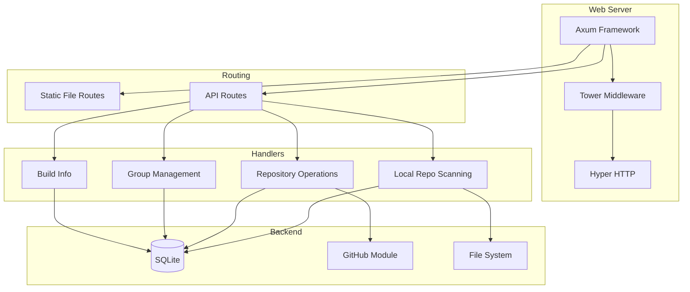
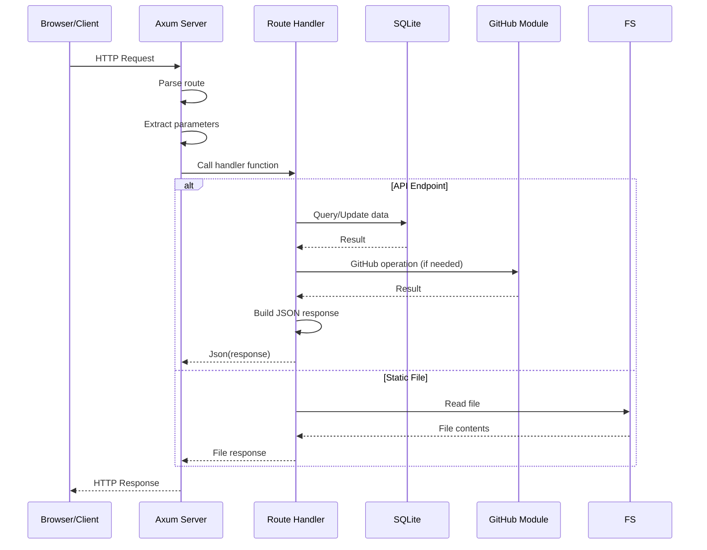
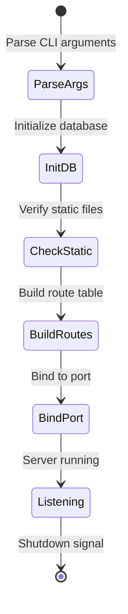
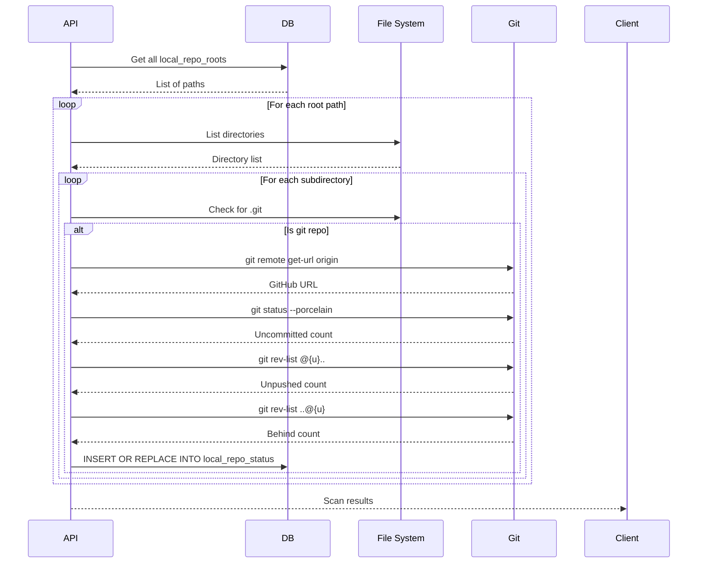

# Web Server & API

This page documents the Axum web server and REST API endpoints for **overall**.

## Table of Contents

- [Server Architecture](#server-architecture)
- [Starting the Server](#starting-the-server)
- [API Endpoints](#api-endpoints)
- [Request/Response Formats](#requestresponse-formats)
- [Error Handling](#error-handling)
- [CORS and Security](#cors-and-security)

## Server Architecture

### Technology Stack



### Server Components

```rust
// overall-cli/src/server/mod.rs

use axum::{
    Router,
    routing::{get, post},
    extract::{Path, State},
    Json,
};
use tower_http::services::ServeDir;

pub async fn run_server(port: u16) -> Result<()> {
    let app = Router::new()
        // API routes
        .route("/api/build-info", get(build_info))
        .route("/api/groups", post(create_group))
        .route("/api/groups/:id/repos/:repo_id", post(move_repo_to_group))
        .route("/api/repos/create-pr", post(create_pull_request))
        .route("/api/repos/create-all-prs", post(create_all_pull_requests))
        .route("/api/local-repo-roots", post(add_local_repo_root))
        .route("/api/local-repos/scan", post(scan_local_repos))
        .route("/api/local-repos/status", get(get_local_repo_status))

        // Static file serving
        .nest_service("/", ServeDir::new("static"))

        // Shared state (database connection)
        .with_state(AppState { db: open_database()? });

    let addr = SocketAddr::from(([127, 0, 0, 1], port));
    println!("Server running on http://localhost:{}", port);

    axum::Server::bind(&addr)
        .serve(app.into_make_service())
        .await?;

    Ok(())
}
```

### Request Flow



## Starting the Server

### Command Line

```bash
# Default port (8459)
./target/release/overall serve

# Custom port
./target/release/overall serve --port 3000

# Debug mode (verbose logging)
./target/release/overall serve --debug

# Using script
./scripts/serve.sh [port] [--debug]
```

### Configuration

```rust
pub struct ServerConfig {
    pub port: u16,              // Default: 8459
    pub static_dir: PathBuf,    // Default: ./static
    pub db_path: PathBuf,       // Default: ~/.overall/overall.db
    pub debug: bool,            // Default: false
}
```

### Server Startup Sequence



## API Endpoints

### Overview

| Endpoint | Method | Purpose |
|----------|--------|---------|
| `/api/build-info` | GET | Get build metadata |
| `/api/groups` | POST | Create new group |
| `/api/groups/:id/repos/:repo_id` | POST | Move repo to group |
| `/api/repos/create-pr` | POST | Create pull request |
| `/api/repos/create-all-prs` | POST | Create PRs for all ready branches |
| `/api/local-repo-roots` | POST | Add local repository root path |
| `/api/local-repos/scan` | POST | Scan local directories for repos |
| `/api/local-repos/status` | GET | Get local git status for all repos |

---

### GET /api/build-info

Returns build metadata including version, commit hash, and build date.

**Request:**
```http
GET /api/build-info HTTP/1.1
Host: localhost:8459
```

**Response:**
```json
{
  "version": "0.1.0",
  "commit": "abc123def456",
  "build_date": "2025-11-17T12:00:00Z",
  "wasm_build_date": "2025-11-17T12:01:00Z"
}
```

**Implementation:**
```rust
async fn build_info() -> Json<BuildInfo> {
    Json(BuildInfo {
        version: env!("CARGO_PKG_VERSION").to_string(),
        commit: option_env!("GIT_COMMIT")
            .unwrap_or("unknown")
            .to_string(),
        build_date: option_env!("BUILD_DATE")
            .unwrap_or("unknown")
            .to_string(),
        wasm_build_date: include_str!("../../static/pkg/.build-date")
            .trim()
            .to_string(),
    })
}
```

**Usage:**
- Frontend uses this to detect when backend/frontend are out of sync
- Cache busting for static assets

---

### POST /api/groups

Creates a new repository group.

**Request:**
```http
POST /api/groups HTTP/1.1
Host: localhost:8459
Content-Type: application/json

{
  "name": "High Priority"
}
```

**Response:**
```json
{
  "id": 5,
  "name": "High Priority",
  "display_order": 0,
  "created_at": "2025-11-17T12:00:00Z"
}
```

**Errors:**
- `400 Bad Request`: Missing or invalid name
- `409 Conflict`: Group name already exists
- `500 Internal Server Error`: Database error

**Implementation:**
```rust
#[derive(Deserialize)]
struct CreateGroupRequest {
    name: String,
}

async fn create_group(
    State(state): State<AppState>,
    Json(req): Json<CreateGroupRequest>,
) -> Result<Json<Group>, StatusCode> {
    if req.name.is_empty() {
        return Err(StatusCode::BAD_REQUEST);
    }

    let group = state.db.create_group(&req.name)
        .map_err(|_| StatusCode::INTERNAL_SERVER_ERROR)?;

    // Trigger export to update repos.json
    export_to_json(&state.db)?;

    Ok(Json(group))
}
```

---

### POST /api/groups/:id/repos/:repo_id

Moves a repository to a different group.

**Request:**
```http
POST /api/groups/5/repos/softwarewrighter%2Foverall HTTP/1.1
Host: localhost:8459
```

**Response:**
```json
{
  "success": true,
  "message": "Repository moved to group"
}
```

**URL Parameters:**
- `id`: Group ID (integer)
- `repo_id`: Repository ID (URL-encoded, format: `owner/repo`)

**Errors:**
- `404 Not Found`: Group or repository doesn't exist
- `500 Internal Server Error`: Database error

**Implementation:**
```rust
async fn move_repo_to_group(
    State(state): State<AppState>,
    Path((group_id, repo_id)): Path<(i64, String)>,
) -> Result<Json<SuccessResponse>, StatusCode> {
    // Verify group exists
    state.db.get_group(group_id)
        .map_err(|_| StatusCode::NOT_FOUND)?;

    // Verify repo exists
    state.db.get_repository(&repo_id)
        .map_err(|_| StatusCode::NOT_FOUND)?;

    // Move repo (removes from old group if any)
    state.db.move_repo_to_group(&repo_id, group_id)
        .map_err(|_| StatusCode::INTERNAL_SERVER_ERROR)?;

    // Trigger export
    export_to_json(&state.db)?;

    Ok(Json(SuccessResponse {
        success: true,
        message: "Repository moved to group".to_string(),
    }))
}
```

---

### POST /api/repos/create-pr

Creates a pull request for a specific branch.

**Request:**
```http
POST /api/repos/create-pr HTTP/1.1
Host: localhost:8459
Content-Type: application/json

{
  "owner": "softwarewrighter",
  "repo": "overall",
  "branch": "feature-branch",
  "base": "main",
  "title": "Add new feature",
  "body": "This PR adds a new feature that..."
}
```

**Response:**
```json
{
  "success": true,
  "pr_number": 42,
  "pr_url": "https://github.com/softwarewrighter/overall/pull/42"
}
```

**Request Body:**
```typescript
{
  owner: string;      // GitHub username/org
  repo: string;       // Repository name
  branch: string;     // Head branch name
  base: string;       // Base branch (e.g., "main")
  title: string;      // PR title
  body: string;       // PR description
}
```

**Errors:**
- `400 Bad Request`: Missing required fields
- `409 Conflict`: PR already exists for this branch
- `422 Unprocessable Entity`: Branch is not ahead of base
- `500 Internal Server Error`: GitHub API error

**Implementation:**
```rust
#[derive(Deserialize)]
struct CreatePrRequest {
    owner: String,
    repo: String,
    branch: String,
    base: String,
    title: String,
    body: String,
}

async fn create_pull_request(
    State(state): State<AppState>,
    Json(req): Json<CreatePrRequest>,
) -> Result<Json<PrResponse>, StatusCode> {
    // Check if PR already exists
    let existing_pr = state.db
        .get_pr_for_branch(&format!("{}/{}", req.owner, req.repo), &req.branch)
        .ok();

    if existing_pr.is_some() {
        return Err(StatusCode::CONFLICT);
    }

    // Create PR via GitHub
    let pr = github::create_pull_request(&PrRequest {
        owner: req.owner,
        repo: req.repo,
        head: req.branch,
        base: req.base,
        title: req.title,
        body: req.body,
    })
    .map_err(|_| StatusCode::INTERNAL_SERVER_ERROR)?;

    // Save to database
    state.db.insert_pull_request(&pr)?;

    // Update branch status
    state.db.update_branch_status(&pr.branch_id, "PROpen")?;

    // Trigger export
    export_to_json(&state.db)?;

    Ok(Json(PrResponse {
        success: true,
        pr_number: pr.number,
        pr_url: pr.url,
    }))
}
```

---

### POST /api/repos/create-all-prs

Creates pull requests for all branches with status `ReadyForPR`.

**Request:**
```http
POST /api/repos/create-all-prs HTTP/1.1
Host: localhost:8459
Content-Type: application/json

{
  "base": "main",
  "dry_run": false
}
```

**Response:**
```json
{
  "success": true,
  "created": [
    {
      "repo": "owner/repo1",
      "branch": "feature-x",
      "pr_number": 42
    },
    {
      "repo": "owner/repo2",
      "branch": "fix-bug",
      "pr_number": 15
    }
  ],
  "skipped": [
    {
      "repo": "owner/repo3",
      "branch": "wip-branch",
      "reason": "Already has open PR"
    }
  ],
  "failed": []
}
```

**Request Body:**
```typescript
{
  base?: string;      // Base branch (default: "main")
  dry_run?: boolean;  // If true, don't actually create PRs (default: false)
}
```

**Implementation:**
```rust
async fn create_all_pull_requests(
    State(state): State<AppState>,
    Json(req): Json<CreateAllPrsRequest>,
) -> Result<Json<CreateAllPrsResponse>, StatusCode> {
    let base = req.base.unwrap_or_else(|| "main".to_string());

    // Find all branches ready for PR
    let ready_branches = state.db
        .get_branches_by_status("ReadyForPR")
        .map_err(|_| StatusCode::INTERNAL_SERVER_ERROR)?;

    let mut created = vec![];
    let mut skipped = vec![];
    let mut failed = vec![];

    for branch in ready_branches {
        if req.dry_run.unwrap_or(false) {
            created.push(PrCreationResult {
                repo: branch.repo_id.clone(),
                branch: branch.name.clone(),
                pr_number: 0,
            });
            continue;
        }

        // Generate PR title and body
        let title = format!("Merge {} into {}", branch.name, base);
        let body = format!("Auto-generated PR for branch {}", branch.name);

        match github::create_pull_request(&PrRequest {
            owner: branch.owner,
            repo: branch.repo,
            head: branch.name.clone(),
            base: base.clone(),
            title,
            body,
        }) {
            Ok(pr) => {
                state.db.insert_pull_request(&pr)?;
                created.push(PrCreationResult {
                    repo: branch.repo_id,
                    branch: branch.name,
                    pr_number: pr.number,
                });
            }
            Err(e) => {
                failed.push(PrCreationFailure {
                    repo: branch.repo_id,
                    branch: branch.name,
                    error: e.to_string(),
                });
            }
        }
    }

    export_to_json(&state.db)?;

    Ok(Json(CreateAllPrsResponse {
        success: failed.is_empty(),
        created,
        skipped,
        failed,
    }))
}
```

---

### POST /api/local-repo-roots

Adds a filesystem path to scan for local git repositories.

**Request:**
```http
POST /api/local-repo-roots HTTP/1.1
Host: localhost:8459
Content-Type: application/json

{
  "path": "/home/user/projects"
}
```

**Response:**
```json
{
  "success": true,
  "id": 3,
  "path": "/home/user/projects"
}
```

**Errors:**
- `400 Bad Request`: Invalid or non-existent path
- `409 Conflict`: Path already exists
- `500 Internal Server Error`: Database error

---

### POST /api/local-repos/scan

Scans all configured local repository roots for git repositories.

**Request:**
```http
POST /api/local-repos/scan HTTP/1.1
Host: localhost:8459
```

**Response:**
```json
{
  "success": true,
  "scanned_paths": [
    "/home/user/projects"
  ],
  "found_repos": 15,
  "updated_statuses": 15,
  "errors": []
}
```

**Implementation Flow:**



---

### GET /api/local-repos/status

Returns local git status for all repositories.

**Request:**
```http
GET /api/local-repos/status HTTP/1.1
Host: localhost:8459
```

**Response:**
```json
{
  "statuses": [
    {
      "repo_id": "softwarewrighter/overall",
      "local_path": "/home/user/projects/overall",
      "current_branch": "main",
      "uncommitted_files": 0,
      "unpushed_commits": 0,
      "behind_commits": 0,
      "is_dirty": false,
      "last_checked": "2025-11-17T12:00:00Z"
    },
    {
      "repo_id": "user/another-repo",
      "local_path": "/home/user/projects/another-repo",
      "current_branch": "feature-branch",
      "uncommitted_files": 5,
      "unpushed_commits": 2,
      "behind_commits": 0,
      "is_dirty": true,
      "last_checked": "2025-11-17T12:00:00Z"
    }
  ]
}
```

**Usage:**
- Frontend polls this endpoint every 60 seconds
- Used to display status icons (needs-sync, local-changes, etc.)
- Determines tab and row icon priority

---

## Request/Response Formats

### Common Response Types

**Success Response:**
```typescript
{
  success: boolean;
  message?: string;
}
```

**Error Response:**
```typescript
{
  error: string;
  details?: string;
}
```

### HTTP Status Codes

| Code | Meaning | Usage |
|------|---------|-------|
| 200 | OK | Successful GET/POST |
| 201 | Created | Resource created |
| 400 | Bad Request | Invalid input |
| 404 | Not Found | Resource doesn't exist |
| 409 | Conflict | Duplicate or constraint violation |
| 422 | Unprocessable Entity | Valid input but can't process |
| 500 | Internal Server Error | Server-side error |

## Error Handling

### Error Response Format

```rust
#[derive(Serialize)]
struct ErrorResponse {
    error: String,
    #[serde(skip_serializing_if = "Option::is_none")]
    details: Option<String>,
}

impl From<anyhow::Error> for ErrorResponse {
    fn from(err: anyhow::Error) -> Self {
        ErrorResponse {
            error: err.to_string(),
            details: err.chain()
                .skip(1)
                .map(|e| e.to_string())
                .collect::<Vec<_>>()
                .join(", ")
                .into(),
        }
    }
}
```

### Error Handling Pattern

```rust
async fn handler(
    State(state): State<AppState>,
    Json(req): Json<Request>,
) -> Result<Json<Response>, (StatusCode, Json<ErrorResponse>)> {
    // Validate input
    if req.name.is_empty() {
        return Err((
            StatusCode::BAD_REQUEST,
            Json(ErrorResponse {
                error: "Name is required".to_string(),
                details: None,
            }),
        ));
    }

    // Perform operation
    let result = state.db.operation(&req)
        .map_err(|e| (
            StatusCode::INTERNAL_SERVER_ERROR,
            Json(ErrorResponse::from(e)),
        ))?;

    Ok(Json(result))
}
```

## CORS and Security

### CORS Configuration

Currently disabled for local development:

```rust
use tower_http::cors::CorsLayer;

let app = Router::new()
    .route(...)
    .layer(CorsLayer::permissive()); // Allow all origins (local dev only)
```

### Security Considerations

1. **Local-Only**: Server binds to `127.0.0.1` (localhost only)
2. **No Authentication**: Not needed for local desktop app
3. **No HTTPS**: Not needed for localhost
4. **Input Validation**: All inputs validated before database operations
5. **SQL Injection**: Protected via parameterized queries (rusqlite)

### Future Production Security

For cloud deployment:

```rust
let app = Router::new()
    .route(...)
    .layer(
        CorsLayer::new()
            .allow_origin("https://app.example.com".parse::<HeaderValue>().unwrap())
            .allow_methods([Method::GET, Method::POST])
            .allow_headers([AUTHORIZATION, CONTENT_TYPE])
    )
    .layer(
        ServiceBuilder::new()
            .layer(HandleErrorLayer::new(|_: BoxError| async {
                StatusCode::INTERNAL_SERVER_ERROR
            }))
            .layer(TimeoutLayer::new(Duration::from_secs(30)))
            .layer(TraceLayer::new_for_http())
    );
```

## Related Documentation

- [Architecture Overview](Architecture-Overview) - High-level system design
- [Data Flow](Data-Flow) - API request/response sequences
- [UI Components](UI-Components) - How frontend calls these APIs

---

[← Back to Home](Home)
